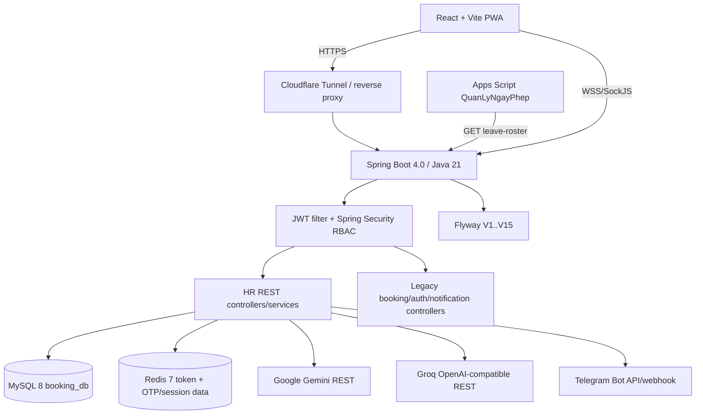

# CFCBase — Master Context hiện hành

> **Ngày cập nhật theo source:** 04/09/2026 (Asia/Ho_Chi_Minh)
> **Mục đích:** bản đồ duy nhất để hiểu, vận hành và tiếp tục phát triển repository CFCBase.
> **Nguyên tắc:** code, migration và cấu hình hiện tại là nguồn sự thật; tài liệu cũ hoặc ảnh giao diện chỉ dùng để đối chiếu.

## 1. Phạm vi sản phẩm

CFCBase là hệ thống web nội bộ của CFC. Từ 27/07/2026, phạm vi phát triển chủ động chỉ còn **Quản lý Nhân sự (HR)**. Các phần đặt phòng, xe và duyệt booking vẫn nằm trong repository để tương thích dữ liệu/URL nhưng được coi là **legacy/frozen**, không mở rộng nếu chưa có yêu cầu mới.

| Khu vực | Trạng thái source hiện tại | Ghi chú |
|---|---|---|
| HR core | Đang phát triển | Hồ sơ, biến động, roster, danh mục, hợp đồng, tài liệu, thử việc, LĐPT |
| OCR hồ sơ | Đã có | Gemini/Groq cấu hình trong `hr_system_settings`, key lấy từ DB hoặc env |
| Payroll Telegram | Đã có | Import Excel → campaign → gửi/retry qua bot; nhân viên dùng Telegram, không dùng React HR |
| Attendance | MVP đã có | Multi-file, nhận diện ngày, tự điền lượt thiếu, giữ dòng không chấm, xuất file và xóa import |
| Lateness/TONGHOP/Dashboard Attendance | Chưa port đầy đủ | Bản Apps Script vẫn là pipeline tham chiếu; xem [kế hoạch migration](ATTENDANCE_MIGRATION_PLAN.md) |
| Google Apps Script ngày phép | API đọc đã có | `/api/v1/hr/sync/leave-roster` hiện được permit trong Security; cần bổ sung cơ chế secret/API key khi harden |
| Booking phòng/xe | Đóng băng | Không xóa code/bảng/route legacy; frontend cũ đã redirect các URL chính về HR |

Không có xác nhận deploy production trong tài liệu này. Các con số nhân sự trong migration hoặc file Excel chỉ là dữ liệu fixture/seed, không được hiểu là số liệu production hiện tại nếu chưa kiểm tra DB thật.

## 2. Kiến trúc hiện hành



### Runtime và công nghệ

- Backend: Spring Boot **4.0.0**, Java **21**, Spring MVC, JPA/Hibernate, Security, WebSocket/STOMP, Redis, Mail, Actuator.
- Database: MySQL 8; các đối tượng HR do Flyway sở hữu. `LegacySchemaFilterProvider` ngăn Hibernate tự tạo/sửa/xóa bảng `hr_*`.
- Migration hiện có: **V1 đến V15**, tổng cộng **31 bảng `hr_*`** được tạo bởi các migration.
- File Excel/DOCX: Apache POI 5.4.1; hợp đồng DOCX dùng template trong `backend/src/main/resources/hr/templates/`.
- Frontend: React **19.2**, React Router **7**, Vite **8**, Tailwind CSS **4**, Axios, `react-datepicker`, `xlsx`, Lucide, PWA Workbox.
- Token: access JWT ngắn hạn, refresh JWT lưu cookie/Redis; mọi API HR yêu cầu principal ADMIN hoặc MANAGER, trừ các route được permit riêng.

## 3. Cây thư mục source (đã loại `.git`, `target`, `node_modules`, `dist`, `.DS_Store`)

```text
CFCBase/
├── .cursorrules
├── .gitignore
├── AGENTS.md
├── docker-compose.yml
├── Danh sách nhân sự 2026.xlsx
├── HUONG_DAN_CAI_TELEGRAM_NHAN_PHIEU_LUONG.md
├── backend/
│   ├── pom.xml, mvnw, mvnw.cmd
│   └── src/
│       ├── main/java/com/booking/system/
│       │   ├── BookingSystemApplication.java
│       │   ├── config/ (AsyncConfig, DataSeeder, EmployeeDataSeeder, FlywayConfig,
│       │   │   HrProbationJobTemplateSeeder, LegacySchemaFilterProvider,
│       │   │   SecurityConfig, WebConfig, WebPushConfig, WebSocketConfig)
│       │   ├── controller/ (ApprovalController, AuthController, BookingCarController,
│       │   │   BookingRoomController, DashboardController, DepartmentController,
│       │   │   NotificationController, ProfileUpdateRequestController,
│       │   │   PushSubscriptionController, ResourceController, SpaForwardController,
│       │   │   UserController)
│       │   ├── dto/ (Auth, admin user, booking, dashboard, notification, profile,
│       │   │   push, registration và response DTOs)
│       │   ├── entity/ (User, Department, Room, Vehicle, BookingRoom, BookingCar,
│       │   │   ApprovalStep, Notification, ProfileUpdateRequest, PushSubscription,
│       │   │   VehicleType)
│       │   ├── enums/ (RoleEnum, UserStatus, booking/approval/notification/profile enums)
│       │   ├── event/ (NotificationEvent, NotificationEventListener)
│       │   ├── repository/ (repository cho user, booking, room, vehicle, approval,
│       │   │   notification, profile request, push và department)
│       │   ├── security/ (JwtAuthFilter, JwtUtils)
│       │   ├── service/ (AuthService, UserAdminService, UserProfileService,
│       │   │   AccountRegistrationService, ApprovalService, DashboardService,
│       │   │   BookingRoomService, BookingCarService, NotificationService,
│       │   │   ProfileUpdateRequestService, EmailService, EmailTemplateService,
│       │   │   OtpService, OtpMailService, PushService, PushSubscriptionService)
│       │   └── hr/
│       │       ├── api/ (HrManagementController, HrActivityController,
│       │       │   HrWorkforceController, HrImportController, HrAttendanceController,
│       │       │   HrProbationController, HrOnboardingController, HrEmployeeDocumentController,
│       │       │   HrEmploymentContractController, HrOcrController, HrPayrollController,
│       │       │   HrTelegramController, HrLeaveSyncController, TelegramWebhookController,
│       │       │   HrActorResolver, HrActivityQueryService, HrApiException* )
│       │       ├── api/dto/ (attendance, audit, employee documents, contracts, imports,
│       │       │   leave, movements, OCR, onboarding, payroll, probation, roster, Telegram DTOs)
│       │       ├── dto/HrApiDtos.java
│       │       ├── entity/ (31 HR entities/support classes: employee, employment, identity,
│       │       │   insurance, contacts, leave, movements, roster, imports, catalogs,
│       │       │   probation, contracts, documents, payroll, Telegram, audit, settings)
│       │       ├── enums/ (attendance, employee, employment, import, movement, roster,
│       │       │   probation, payroll, Telegram, document và catalog enums)
│       │       ├── importer/ (baseline/workforce parsers, persistence, preview, payload
│       │       │   retention, actor, issue và contract classes)
│       │       ├── repository/ (Spring Data repository cho từng HR aggregate)
│       │       └── service/ (HrManagementService, HrWorkforceService, HrRosterProjectionService,
│       │           HrImport*, HrAttendanceService, HrProbationService, HrOnboardingService,
│       │           HrEmploymentContractService, HrEmploymentContractDocumentService,
│       │           HrEmployeeDocumentService, HrExcelExportService, HrLeave*, HrOcrService,
│       │           HrPayroll*, HrTelegram*, HrSystem/Telegram client)
│       ├── main/resources/
│       │   ├── application.properties
│       │   ├── db/migration/V1__...sql đến V15__...sql
│       │   └── hr/templates/ (employment-contract-general-labor-template.docx,
│       │       employment-contract-office-template.docx, labor-book-template.xlsx,
│       │       probation-contract-template.docx, workforce-export-template.xlsx)
│       └── test/java/com/booking/system/ (unit, API, schema, migration và integration tests)
├── deployserver/
│   ├── linux/ (build-prod.sh, run.sh, stop-prod.sh, backup-database.sh,
│   │   restore-database.sh, capture-legacy-table-counts.sh, verify-hr-phase1.sh,
│   │   install-backup-timer.sh, desktop files, systemd service/timer)
│   └── window/ (build-prod.bat, run.bat, start-tunnel.bat, stop-prod.bat)
├── documents/
│   ├── PROJECT_MASTER_CONTEXT.md       # file master này
│   ├── ATTENDANCE_MIGRATION_PLAN.md
│   └── DATABASE_BACKUP.md
├── frontend/
│   ├── package.json, package-lock.json, vite.config.js, index.html
│   ├── public/ (logo, OG image, robots, sitemap, offline, PWA icons)
│   └── src/
│       ├── App.jsx, App.css, index.css, main.jsx, sw.js
│       ├── api/ (base/auth/storage, user, profile, approval, booking, dashboard,
│       │   notification, push/resource và toàn bộ hr*Api.js)
│       ├── components/ (ui, admin, booking, calendar, HR và PWA/push components)
│       ├── contexts/NotificationContext*, hooks/usePushNotifications.js
│       ├── layouts/ (DashboardLayout + app-shell sidebar/topbar/mobile/footer/menu)
│       ├── pages/ (Login/Register/Profile/ForgotPassword, Admin*, legacy Booking*,
│       │   và pages/hr: Overview, Employees, Forms, Probation, GeneralLabor,
│       │   Catalogs, Imports, Movements, Rosters, Audit, Telegram, Payroll, Attendance)
│       ├── styles/ (cfc-design-system.css, hr-responsive.css)
│       └── utils/ (roleNavigation, hr, documents, onboarding, datetime, downloads,
│           notification, appBadge)
└── scripts/ (database/Excel/template inspection, HR schema verification,
    Apps Script/document helpers và compiled fixture data)
```

Danh sách file đầy đủ hơn theo package nằm trực tiếp trong các thư mục source; không đưa các artifact build/cache vào bản đồ vì chúng được sinh lại.

## 4. Backend HR — luồng nghiệp vụ

### 4.1 Hồ sơ và danh mục

`HrManagementController` + `HrManagementService` cung cấp overview, tìm kiếm/phân trang nhân sự, CRUD hồ sơ và CRUD ba danh mục: phòng ban, chức vụ, điều kiện lao động. `HrActorResolver` lấy actor từ principal JWT; audit lưu trong `hr_audit_events`.

### 4.2 Import baseline/workforce và biến động

- `HrImportController` nhận workbook baseline/workforce, tạo batch, preview, validate, confirm và rollback.
- `HrBaselineWorkbookParser`/`HrWorkforceSnapshotImportService` chuẩn hóa dữ liệu Excel và kiểm tra checksum hợp đồng fixture.
- `HrWorkforceService` quản lý tăng/giảm, adjustment, confirm/cancel hàng loạt và optimistic row version.
- `HrRosterProjectionService` dựng quân số theo kỳ từ baseline + movement đã confirm; roster có vòng đời draft/open/closed/reopen.
- Dữ liệu import thô có retention job; không log payload PII.

### 4.3 Thử việc, onboarding và hợp đồng

`HrProbationService` quản lý ứng viên, template công việc, trạng thái start/pass/fail, sinh HĐTV DOCX và chuyển thành draft nhân sự. `HrOnboardingService` tiếp nhận LĐ phổ thông. `HrEmploymentContractService` và `HrEmploymentContractDocumentService` sinh/lưu tài liệu HĐLĐ bất biến từ template; `HrEmployeeDocumentService` lưu tài liệu đính kèm và hỗ trợ view/download/delete.

### 4.4 OCR

`HrOcrService` nhận nhiều ảnh multipart và trả JSON hồ sơ để form React tự điền. Provider/model/key được lưu ở `hr_system_settings`, có thể fallback sang `GEMINI_API_KEY`/`GROQ_API_KEY` từ environment.

- Mặc định source hiện tại: Gemini `gemini-3.6-flash`, Groq `qwen/qwen3.6-27b`.
- Các tên model cũ được normalize trước khi gọi; lỗi 401/403/404 được chuyển thành mã lỗi OCR rõ ràng.
- Groq thử JSON mode, nếu `json_validate_failed` thì retry prompt-only rồi parser JSON nội bộ kiểm tra tiếp.
- API key không được trả nguyên văn trong DTO/UI; không commit key thật.

### 4.5 Payroll và Telegram

`HrPayrollService`/`HrPayrollWorkbookParser` import file lương; `HrPayrollCampaignService` tạo campaign, start, xem delivery và retry. `HrTelegramService` quản lý bot settings, QR/common link, registrations, verify/reject, revoke binding, summary và export. `TelegramWebhookController` nhận callback từ Telegram. Nhân viên chỉ dùng bot; HR/Admin thao tác trên React.

### 4.6 Ngày phép

`HrLeaveSyncService` xuất roster active hoặc cả nhân sự đã giảm theo kỳ tháng cho Apps Script. CFCBase giữ hạn mức/phép gốc và trạng thái nhân sự; giao dịch `used_days` của ứng dụng ngoài không nằm trong module này.

## 5. Attendance hiện hành trong CFCBase

Đối chiếu với [Attendance/TONG_HOP_DU_AN_ATTENDANCE.md](../Attendance/TONG_HOP_DU_AN_ATTENDANCE.md) và [Attendance/docs](../Attendance/docs/README.md):

1. UI `/manager/hr/attendance` tải cấu hình và lịch sử import; cấu hình có dòng tiêu đề, cột mã/tên/ngày, cột giờ G/H/I/J, khung check-in/out, giờ chuẩn, grace và danh sách mã miễn chấm.
2. Có thể chọn nhiều `.xlsx/.xls/.xlsm` qua `/imports/batch`; SHA-256 chống import trùng.
3. Backend Apache POI đọc ngày Excel numeric hoặc chuỗi `yyyy-MM-dd`, `d/M/uuuu`, `d-MMM-yy` (ví dụ `01-Jul-26`) và các biến thể đã khai báo.
4. Lấy check-in sớm nhất trong 04:00–09:00 và check-out muộn nhất trong 15:00–20:00 (theo config).
5. Chỉ có một phía: tự điền phía còn thiếu bằng default; nếu default bỏ trống thì dùng giờ chuẩn, cuối cùng là **07:30/16:30**. Gắn trạng thái `AUTO_FILLED` và lý do.
6. Không có lượt chấm: giữ nguyên dòng với `NO_PUNCH`; không coi là lỗi để không làm mất ngày nghỉ, cuối tuần hoặc ngày máy không ghi nhận.
7. Mã miễn chấm: lưu `EXCLUDED`, công bằng 0. File format vẫn xuất toàn bộ dòng; file `CONG_...` quy đổi excluded/no-punch = 0.
8. `/export` sinh file sạch 8 cột (STT, mã, tên, phòng ban, ngày, thứ, lần 1, lần 2); `/cong-export` sinh bảng pivot nhân viên × ngày; `DELETE /imports/{id}` xóa batch và record liên quan.

Các phần Apps Script **Lateness → TONGHOP → Dashboard** chưa có service/controller tương đương trong CFCBase. Kế hoạch port nằm ở [ATTENDANCE_MIGRATION_PLAN.md](ATTENDANCE_MIGRATION_PLAN.md). Lưu ý script `verify-hr-phase1.sh` vẫn kiểm tra bộ 15 bảng Phase 1, không phải toàn bộ 31 bảng sau V15; cần cập nhật trước khi dùng làm healthcheck tổng.

## 6. Phân quyền và đăng nhập

`RoleEnum` hiện có `ADMIN`, `MANAGER`, `EMPLOYEE`; `UserStatus` có trạng thái active/pending/rejected/inactive.

| Đối tượng | Đăng nhập | HR API | Admin user API |
|---|---:|---:|---:|
| ADMIN + ACTIVE | Có | Có | Có toàn quyền theo service |
| MANAGER + ACTIVE | Có | Có | Không |
| EMPLOYEE (kể cả ACTIVE) | Không | Không | Không |
| Pending/rejected/inactive | Không | Không | Chỉ admin hiện hành có thể cập nhật trạng thái |

`AuthService.requireLoginRole()` chặn EMPLOYEE ở password login, Google login và refresh. `JwtAuthFilter` chỉ dựng principal cho ACTIVE ADMIN/MANAGER; token cũ của user bị khóa không được dùng tiếp. `SecurityConfig` bảo vệ `/api/v1/hr/**` bằng ADMIN/MANAGER, `/api/v1/dashboard/admin` bằng ADMIN; webhook Telegram và `/api/v1/hr/sync/**` đang permit theo source.

Admin có thể phân trang/tìm kiếm user, lọc role/status, tạo/cập nhật user, reset password và thu hồi toàn bộ session; không thể tự hạ quyền hoặc tự khóa tài khoản ADMIN đang đăng nhập. Đăng ký OTP tạo tài khoản MANAGER `PENDING_APPROVAL`, sau đó Admin duyệt.

Frontend `App.jsx` dùng `ProtectedRoute`, `AdminRoute`, `HrRoute`; `roleNavigation.js` đưa mọi role hợp lệ về `/manager/hr`. Các route booking/notification cũ redirect về HR để deep link không gãy; menu hiện tại chỉ hiển thị HR và khu vực quản trị tài khoản.

## 7. API catalog hiện tại

### Auth và tài khoản

`POST /api/v1/auth/login|google|refresh|logout`, `POST /api/v1/auth/register/request-otp|register/verify|forgot-password/request-otp|forgot-password/reset`; user/profile: `GET /api/v1/users`, `/me`, `/approvers`, registration approvals; `POST/PATCH /api/v1/users...` cho Admin và đổi profile/password theo service.

### HR management/workforce

- `/api/v1/hr/overview`, `/employees`, `/employees/{id}`, `/catalogs/{type}`: GET/POST/PATCH.
- `/api/v1/hr/movements`, `/movements/{id}/adjustments|confirm|cancel`, bulk-confirm/bulk-cancel, delete draft; `/employees/{id}` delete draft.
- `/api/v1/hr/rosters`, `/rosters/{id}|/items`, open/close/reopen/delete; reconciliation.
- `/api/v1/hr/audit`, `/exports/month|year|labor-book/month|labor-book/year`.

### Import, hồ sơ, hợp đồng, OCR

- `/api/v1/hr/imports`: list, baseline/workforce multipart, preview, validate, confirm, rollback.
- `/api/v1/hr/employees/{id}/documents` GET/POST/batch; `/employee-documents/{id}` GET/PATCH/DELETE, `/view`, `/download`.
- `/api/v1/hr/employment-contracts/{id}/documents` POST; `/employment-contract-documents/{id}/download` GET.
- `/api/v1/hr/ocr/settings` GET/POST; `/ocr/extract-profile` multipart POST.
- `/api/v1/hr/probation/...` candidates, contracts/download, state transitions, job templates; `/onboarding/general-labor` POST.

### Payroll, Telegram, Attendance, sync

- Payroll: `/api/v1/hr/payroll/imports` GET/POST, preview, campaigns POST, campaign GET/start/deliveries/retry.
- Telegram: `/api/v1/hr/telegram/settings` GET/PUT, test-connection, common-link, registrations, employees, summary, verify/reject/revoke, export; webhook `/api/v1/integrations/telegram/payroll/webhook`.
- Attendance: `/api/v1/hr/attendance/settings` GET/PUT; `/imports` POST, `/imports/batch` POST, list, preview, export, cong-export, delete.
- Leave sync: `GET /api/v1/hr/sync/leave-roster?period=&activeOnly=`.

### Legacy/frozen endpoints

Room/car booking (`/api/v1/bookings/rooms`, `/cars`), approval (`/api/v1/approvals`), dashboard client/admin, resources, notifications, push subscriptions và departments vẫn tồn tại để tương thích. Không đưa chúng vào roadmap HR mới.

## 8. Database và migrations

### 8.1 31 bảng HR hiện có trong V1–V15

`hr_excel_template_versions`, `hr_excel_import_batches`, `hr_excel_import_rows`, `hr_departments`, `hr_positions`, `hr_working_conditions`, `hr_employees`, `hr_employee_employment`, `hr_employee_identity`, `hr_employee_insurance`, `hr_employee_contacts`, `hr_employee_movements`, `hr_monthly_rosters`, `hr_monthly_roster_items`, `hr_audit_events`, `hr_probation_job_templates`, `hr_probation_candidates`, `hr_probation_contracts`, `hr_employee_leave_entitlements`, `hr_employment_contracts`, `hr_employment_contract_documents`, `hr_employee_documents`, `hr_system_settings`, `hr_telegram_registrations`, `hr_employee_telegram_bindings`, `hr_payroll_imports`, `hr_payroll_import_rows`, `hr_payroll_campaigns`, `hr_payroll_deliveries`, `hr_attendance_imports`, `hr_attendance_records`.

### 8.2 Lịch sử migration

| Version | Nội dung source |
|---|---|
| V1 | Tạo schema HR Phase 1: catalog, employee, employment, identity, insurance, contacts, movements, roster, import, audit |
| V2 | Payload retention/purge metadata cho import |
| V3 | Ứng viên thử việc, template công việc, hợp đồng thử việc |
| V4 | Liên kết movement điều chỉnh với movement gốc |
| V5 | Hạn mức phép năm và entitlement |
| V6 | Metadata onboarding/workforce group và hợp đồng lao động |
| V7 | Tài liệu hợp đồng lao động bất biến |
| V8 | Kho tài liệu đính kèm nhân sự |
| V9–V11 | Đồng bộ/khôi phục dữ liệu nhân sự 2026 và mã nhân viên theo SQL fixture |
| V12 | `hr_system_settings` cho OCR/provider/model |
| V13 | Đăng ký và binding Telegram |
| V14 | Import payroll, campaign, delivery |
| V15 | Import/record/configuration Attendance |

Flyway cấu hình `baseline-on-migrate` mặc định false, `clean-disabled=true`, `out-of-order=false`. Database legacy chỉ được baseline sau backup đã kiểm tra; không chạy `clean` trên dữ liệu thật.

## 9. Frontend hiện hành

- `DashboardLayout` lấy section từ `navigation.js`; desktop sidebar và mobile bottom sheet dùng cùng metadata.
- HR pages lazy-load dưới `/manager/hr/*`; Admin pages dưới `/admin/*`.
- `baseApi.js` gắn Bearer JWT, tự refresh access token và đưa 401 về login; `authStorage.js` chỉ lưu snapshot user nhỏ trong cookie.
- UI Attendance dùng `react-datepicker` locale Việt cho month picker, chọn nhiều file, preview phân trang, export sạch/CONG và delete.
- UI OCR gồm `HrOcrModal` và `HrOcrSettingsModal`; UI tài liệu có PDF/image inline, Word/Excel hiển thị thẻ tải xuống.
- PWA dùng `vite-plugin-pwa`/`src/sw.js`, web push qua `PushSubscriptionController`; không cache API động nếu chưa có invalidation.

## 10. Cấu hình, secrets và triển khai

`backend/src/main/resources/application.properties` hiện chứa các mặc định an toàn cho Flyway, retention payload và multipart (50 MB/file, 100 MB/request). Những cấu hình khác lấy từ environment/profile, gồm nhóm `spring.datasource.*`, `spring.data.redis.*`, `app.cors.allowed-origins`, `jwt.*`, `spring.mail.*`, `app.webpush.*`, `GEMINI_API_KEY`, `GROQ_API_KEY`, `cfc.telegram.bot-token`, `cfc.telegram.webhook-secret` và Google OAuth client id.

`docker-compose.yml` chạy MySQL 8 (`booking_db`) và Redis 7 (`booking_redis`) với volume bền vững. File compose hiện có giá trị mặc định dành cho local; **không dùng nguyên xi ở production và phải thay/rotate credentials**. `DataSeeder`/`EmployeeDataSeeder` cũng còn tài khoản/mật khẩu mẫu trong source, là rủi ro P0 cần loại khỏi production hoặc bắt đổi ngay lần đầu.

Quy trình Linux được chia thành:

1. `deployserver/linux/build-prod.sh`: `npm ci` + frontend build, Maven package bỏ qua test, smoke test Web Push, kích hoạt JAR.
2. `deployserver/linux/run.sh`: nạp `.env` cục bộ nếu có, start DB/Redis, backend systemd và Cloudflare Tunnel; có cờ `--initialize-hr-schema` cho baseline một lần.
3. `backup-database.sh`/`restore-database.sh`: backup gzip có lock, giữ số bản cấu hình được, restore thủ công có kiểm soát.
4. systemd timer chạy backup; các script Windows tương đương phục vụ môi trường Windows.

Không ghi token Cloudflare, Telegram, JWT, SMTP, VAPID hay database password vào master này.

## 11. Kiểm thử và trạng thái xác nhận

- Backend có test unit/API/schema/migration cho auth, dashboard, HR import/workforce/probation/document/OCR/leave và legacy service.
- Frontend có lệnh `npm run lint` và `npm run build`; baseline gần nhất build/lint đạt, còn một số cảnh báo unused hiện hữu.
- `HrPhase1MigrationTest` đã xác nhận 15 migration theo fixture. `./mvnw test` toàn bộ từng bị lỗi môi trường Mockito/Byte Buddy self-attach trên JDK 21 (không phải kết luận business test pass/fail); cần chạy lại trong môi trường CI/JDK được hỗ trợ.
- Các kiểm tra trên là static/unit; chưa chứng minh Cloudflare, Telegram, Gemini/Groq, Google Drive/Apps Script hay database production đang reachable.

## 12. Khoảng trống và roadmap ưu tiên

### P0 — an toàn và dữ liệu

1. Loại bỏ/rotate credential mẫu trong seeder và compose; bắt buộc env secret ở production.
2. Bảo vệ `/api/v1/hr/sync/**` bằng API key/HMAC hoặc gateway allow-list; thêm rate limit cho OCR, import và login.
3. Cập nhật `verify-hr-phase1.sh` thành verify đầy đủ V15/31 bảng; thêm healthcheck migration và backup restore rehearsal.
4. Bổ sung test RBAC 401/403, test token bị thu hồi và test upload/duplicate/delete Attendance.
5. Rà soát `WebSocketConfig`: CONNECT hiện kiểm tra JWT và user tồn tại nhưng chưa kiểm tra đầy đủ ACTIVE + role quản trị như `JwtAuthFilter`.

### P1 — hoàn thiện Attendance migration

1. Port Lateness và TONGHOP vào service/database với quy tắc rõ: `CONG` thiếu một lượt = 0.5; Lateness/Dashboard thiếu lượt = 0.
2. Thêm bước quản trị loại nhân sự đi thị trường/công tác, ngày lễ/nghỉ phép và xác nhận dữ liệu trước khi chốt.
3. Sinh `TONGHOP_...xlsx`, Dashboard KPI/top phòng ban/nhân viên và audit toàn bộ lần export.
4. Hiển thị chênh lệch `VALID/AUTO_FILLED/NO_PUNCH/EXCLUDED/ERROR` nhất quán giữa backend và UI.
5. Ghi audit actor khi xóa attendance import; method hiện nhận actor nhưng thao tác xóa chưa ghi sự kiện audit.

### P1 — HR vận hành

- Thêm phân quyền chi tiết hơn MANAGER/ADMIN nếu nghiệp vụ yêu cầu; hiện MANAGER có quyền HR rộng.
- Hoàn thiện trạng thái/monitoring Telegram, đổi bot an toàn (token + webhook + re-verify binding).
- Cải thiện viewer Office nếu cần preview inline; hiện Word/Excel chủ động tải xuống, PDF/ảnh xem trực tiếp.

### P2 — chất lượng và trải nghiệm

- Tách bundle frontend lớn, bổ sung E2E cho các flow HR quan trọng, keyboard/mobile accessibility.
- Chuẩn hóa error code/message và correlation id; không đưa PII/raw OCR vào log.
- Viết runbook rollback theo từng migration và dashboard observability cho queue Telegram/OCR/import.

## 13. Quy tắc bất biến khi tiếp tục phát triển

1. Chỉ mở rộng HR theo roadmap; không tự khởi động lại Booking Phase 6–10.
2. Không xóa bảng/code legacy để “dọn” repository nếu chưa có kế hoạch migration dữ liệu.
3. Actor/approver/canceller phải lấy từ authenticated principal, không tin id do client gửi.
4. Dữ liệu import/preview phải có pagination, retention và lý do lỗi; không làm mất dòng gốc chỉ vì thiếu giờ.
5. Migration forward-only, backup trước khi baseline/restore, index tạo bằng migration.
6. Không commit secret hoặc log Authorization header, OTP, payload PII.
7. Trước deploy: chạy `npm.cmd run lint`, `npm.cmd run build`, `./mvnw test` (hoặc ghi rõ blocker môi trường), `git diff --check` và smoke/healthcheck tương ứng.

## 14. Tài liệu liên quan

- [AGENTS.md](../AGENTS.md) — luật repository và checklist bảo mật.
- [ATTENDANCE_MIGRATION_PLAN.md](ATTENDANCE_MIGRATION_PLAN.md) — kế hoạch port Attendance chi tiết.
- [Attendance/TONG_HOP_DU_AN_ATTENDANCE.md](../Attendance/TONG_HOP_DU_AN_ATTENDANCE.md) — bản đồ Apps Script gốc.
- [Attendance/docs/README.md](../Attendance/docs/README.md) — vận hành, cấu hình, quy tắc và xử lý sự cố Apps Script.
- [DATABASE_BACKUP.md](DATABASE_BACKUP.md) — backup/restore database.
- [HUONG_DAN_CAI_TELEGRAM_NHAN_PHIEU_LUONG.md](../HUONG_DAN_CAI_TELEGRAM_NHAN_PHIEU_LUONG.md) — hướng dẫn worker đăng ký bot.

## 15. Lịch sử cập nhật master

| Ngày | Thay đổi |
|---|---|
| 04/09/2026 | Viết lại toàn bộ master theo source hiện hành: Spring Boot 4/Java 21, React 19, V1–V15/31 bảng, RBAC thực tế, API HR, Attendance MVP, tree và roadmap. |

## 16. Source anchors để tra cứu nhanh

### Backend

- [pom.xml](../backend/pom.xml) — phiên bản Java/Spring và dependency.
- [SecurityConfig.java](../backend/src/main/java/com/booking/system/config/SecurityConfig.java), [JwtAuthFilter.java](../backend/src/main/java/com/booking/system/security/JwtAuthFilter.java) — auth/RBAC ở HTTP.
- [AuthService.java](../backend/src/main/java/com/booking/system/service/AuthService.java), [UserAdminService.java](../backend/src/main/java/com/booking/system/service/UserAdminService.java) — login, role, quản trị tài khoản.
- [HrAttendanceController.java](../backend/src/main/java/com/booking/system/hr/api/HrAttendanceController.java), [HrAttendanceService.java](../backend/src/main/java/com/booking/system/hr/service/HrAttendanceService.java) — Attendance MVP.
- [HrOcrService.java](../backend/src/main/java/com/booking/system/hr/service/HrOcrService.java), [HrTelegramService.java](../backend/src/main/java/com/booking/system/hr/service/HrTelegramService.java) — tích hợp AI/Telegram.
- [application.properties](../backend/src/main/resources/application.properties) và [db/migration](../backend/src/main/resources/db/migration/) — runtime defaults và schema.

### Frontend

- [App.jsx](../frontend/src/App.jsx), [navigation.js](../frontend/src/layouts/app-shell/navigation.js) — route/protected route/menu.
- [HrAttendance.jsx](../frontend/src/pages/hr/HrAttendance.jsx), [hrAttendanceApi.js](../frontend/src/api/hrAttendanceApi.js) — màn hình/API Attendance.
- [HrOcrModal.jsx](../frontend/src/components/hr/HrOcrModal.jsx), [HrOcrSettingsModal.jsx](../frontend/src/components/hr/HrOcrSettingsModal.jsx) — OCR UI/cấu hình.
- [DashboardLayout.jsx](../frontend/src/layouts/DashboardLayout.jsx), [index.css](../frontend/src/index.css) — shell và design system dùng chung.
