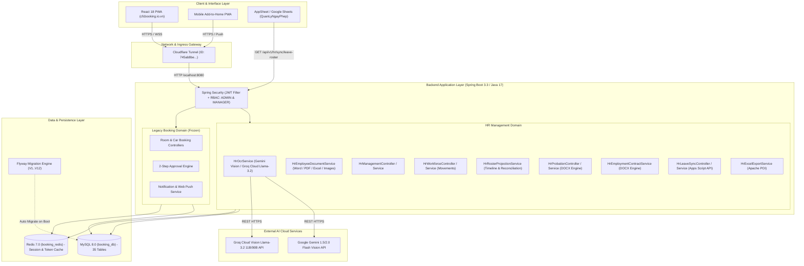

# Tổng Hợp Hệ Thống CFCBase & Quản Lý Nhân Sự Hiện Hành

> **Tài liệu nguồn chuẩn duy nhất (Single Source of Truth) cho toàn bộ hệ thống CFCBase, AI OCR Hồ Sơ & Quản Lý Ngày Phép.**  
> Ngày cập nhật: **2026-09-01** (Production Master Baseline: 338 Nhân sự T8-2026, AI OCR Vision đa nguồn Gemini/Groq, Quản lý tài liệu Đa định dạng Word/PDF/Excel/Ảnh, HĐTV & HĐLĐ DOCX Engine, Phân quyền RBAC Admin/Manager, Apps Script 2-Way Sync).  
> Phạm vi: `backend/`, `frontend/`, `deployserver/linux/`, `clean_database_master.sql`, `Danh sách nhân sự 2026.xlsx`, và tích hợp `AppScriptsCFC/QuanLyNgayPhep/`.

---

## 1. Mục Tiêu & Phạm Vi Hệ Thống

CFCBase là hệ thống nền tảng quản trị điều hành nội bộ của **Công ty Cổ phần Phân bón và Hóa chất Cần Thơ (CFC)**. Hệ thống bao gồm 3 phân hệ chính:

1. **Quản lý Nhân sự (HR Management Core & AI Vision)**: *Phân hệ đang phát triển và vận hành tích cực*.
   - Quản lý hồ sơ **338 nhân sự chính thức tháng T8-2026** (thông tin cá nhân, CCCD/CMND, BHXH, BHYT, mức lương, phụ cấp, hợp đồng, ngày phép năm).
   - **Phân hệ Trích xuất Hồ sơ Thông minh (AI OCR Vision Engine)**: Tích hợp Google Gemini (1.5 Flash / 2.0 Flash) và Groq Cloud (Llama 3.2 Vision) để quét trích xuất ảnh CCCD 2 mặt, sơ yếu lý lịch, đơn xin việc viết tay và tự động điền form.
   - **Quản lý Hồ sơ & Giấy tờ Đính kèm Đa định dạng (Multi-format Documents)**: Hỗ trợ lưu trữ, xem trực tiếp và tải về các file **Microsoft Word** (`.docx`, `.doc`), **Microsoft Excel** (`.xlsx`, `.xls`), **Adobe PDF** (`.pdf`) và **Hình ảnh** (`.png`, `.jpg`, `.jpeg`, `.webp`) với dung lượng lên tới 25MB/file (hỗ trợ tải 1 file và tải hàng loạt Batch Upload).
   - Quản lý vòng đời biến động **Tăng / Giảm nhân sự (Movements)** kèm cơ chế xác nhận nguyên tử (Atomic Confirmation) và xem trước ảnh hưởng (Impact Preview).
   - Quản lý quân số tháng (**Monthly Rosters**) và **Đối soát quân số tự động** kế thừa từ nền T6/T7 sang T8.
   - Quản lý quy trình **Thử việc (Probation)**, đánh giá đạt/không đạt, và **tự động sinh file Word Hợp đồng thử việc (.docx)** chuẩn văn bản công ty.
   - **Engine Xuất Hợp đồng Lao động chính thức (.docx)** tải về từ hồ sơ nhân sự.
   - Quản lý **Lao động phổ thông (General Labor)** và tiếp nhận nhanh.
   - Xuất báo cáo nhân sự định dạng Microsoft Excel (`.xlsx`) theo tháng và theo năm (Báo cáo quân số 34 cột và Sổ Quản lý Lao động 26 cột chuẩn Sheet1 (3)).
2. **Tích hợp Đồng bộ Ngày Phép (Leave Sync Integration)**:
   - Cung cấp API chuẩn cho **Google Apps Script / AppSheet (`QuanLyNgayPhep`)**.
   - Phân định quyền sở hữu dữ liệu: CFCBase quản lý hạn mức phép gốc & thông tin nhân sự; App Ngày Phép quản lý giao dịch nghỉ phép hàng ngày và số ngày phép đã sử dụng (`used_days`), không bị ghi đè hay mất dữ liệu khi đồng bộ.
3. **Đặt Phòng họp & Đặt Xe công tác (Legacy Booking)**: *Phân hệ kế thừa đã đóng băng (frozen)*.
   - Đặt lịch phòng họp, xe công tác, quy trình phê duyệt 2 cấp (`PENDING` $\rightarrow$ `APPROVED` / `REJECTED`).
   - Web Push Notifications & Email thông báo.

---

## 2. Kiến Trúc Tổng Quan (System Architecture)



---

## 3. Cây Thư Mục Chi Tiết & Vai Trò Từng File (Code Map)

```text
CFCBase/
├── AGENTS.md                               # Chỉ dẫn AI: Luật bất biến, checklist an ninh, canonical roadmap
├── docker-compose.yml                      # Chạy MySQL (booking_db:3306) & Redis (booking_redis:6379)
├── clean_database_master.sql               # DDL + DML Master CSDL 35 bảng, 338 nhân sự T8-26, 3 ứng viên thử việc
├── Danh sách nhân sự 2026.xlsx             # File Excel gốc của công ty (Sheet T8-26 là nguồn sự thật 338 nhân sự)
│
├── backend/                                # [SPRING BOOT BACKEND]
│   ├── pom.xml                             # Dependencies: Spring Boot 3, JPA, Security, MySQL, Redis, POI, Flyway
│   ├── mvnw / mvnw.cmd                     # Maven wrapper
│   └── src/main/
│       ├── java/com/booking/system/
│       │   ├── BookingSystemApplication.java # Main application entry point
│       │   ├── config/                     # Cấu hình bảo mật & hạ tầng
│       │   │   ├── SecurityConfig.java         # Spring Security filter chain, RBAC rules (ADMIN & MANAGER), CSRF disabled
│       │   │   ├── CorsConfig.java             # Cho phép cfcbooking.io.vn, localhost:5173, localhost:8080
│       │   │   ├── JwtAuthenticationFilter.java# Interceptor trích xuất Bearer JWT
│       │   │   ├── JwtTokenProvider.java       # Sinh & giải mã JWT access/refresh token
│       │   │   └── RedisConfig.java            # Lettuce connection factory & RedisTemplate
│       │   │
│       │   ├── hr/                         # [PHÂN HỆ HR CORE DOMAIN]
│       │   │   ├── api/                    # REST Controllers
│       │   │   │   ├── HrOcrController.java          # /api/v1/hr/ocr (Trích xuất hồ sơ AI & Cài đặt API Key)
│       │   │   │   ├── HrEmployeeDocumentController.java # /api/v1/hr/employees/{id}/documents (Hồ sơ Word/PDF/Excel/Ảnh)
│       │   │   │   ├── HrManagementController.java   # /api/v1/hr (Tổng quan, DS 338 nhân sự, tìm kiếm, lọc)
│       │   │   │   ├── HrWorkforceController.java    # /api/v1/hr/movements (Tạo/Duyệt/Hủy biến động Tăng/Giảm)
│       │   │   │   ├── HrProbationController.java    # /api/v1/hr/probation (Ứng viên thử việc, HĐTV DOCX, Mẫu việc)
│       │   │   │   ├── HrLeaveSyncController.java    # /api/v1/hr/sync/leave-roster (Đồng bộ Google Apps Script)
│       │   │   │   ├── HrOnboardingController.java   # /api/v1/hr/onboarding (Tiếp nhận LĐPT & Chuyển thử việc)
│       │   │   │   ├── HrImportController.java       # /api/v1/hr/imports (Nhập file Excel nhân sự)
│       │   │   │   ├── HrActivityController.java     # /api/v1/hr/audit (Nhật ký kiểm toán biến động)
│       │   │   │   ├── HrEmploymentContractController.java # /api/v1/hr/employment-contracts (HĐLĐ chính thức Word DOCX)
│       │   │   │   └── dto/                      # DTOs & Records request/response
│       │   │   │
│       │   │   ├── service/                # Business Logic Services
│       │   │   │   ├── HrOcrService.java             # Xử lý trích xuất ảnh OCR (Gemini Vision / Groq Cloud)
│       │   │   │   ├── HrEmployeeDocumentService.java# Quản lý file đính kèm Word, PDF, Excel, Ảnh (Max 25MB)
│       │   │   │   ├── HrManagementService.java      # CRUD nhân sự, phân trang, lọc theo phòng ban/chức vụ
│       │   │   │   ├── HrWorkforceService.java       # Xử lý biến động Tăng/Giảm, vòng đời nhân sự nguyên tử
│       │   │   │   ├── HrRosterProjectionService.java# Tính toán quân số các tháng động từ baseline T6 + movements
│       │   │   │   ├── HrProbationService.java       # Quản lý thử việc, render template DOCX hợp đồng
│       │   │   │   ├── HrEmploymentContractService.java# Tạo & xuất HĐLĐ chính thức DOCX
│       │   │   │   ├── HrLeaveSyncService.java       # Tính thâm niên (Năm-Tháng-Ngày), hạn mức phép xuất Apps Script
│       │   │   │   ├── HrExcelExportService.java     # Xuất file Excel báo cáo quân số & Sổ Quản lý Lao động
│       │   │   │   ├── HrLeaveEntitlementService.java# Quản lý ngày phép năm và điều chỉnh thủ công
│       │   │   │   └── HrActorResolver.java          # Trích xuất thông tin actor từ JWT (hỗ trợ ADMIN & MANAGER)
│       │   │   │
│       │   │   ├── entity/                 # JPA Entities HR
│       │   │   │   ├── HrSystemSetting.java          # Bảng `hr_system_settings` (Cấu hình động API Keys, Provider)
│       │   │   │   ├── HrEmployeeDocument.java       # Bảng `hr_employee_documents` (Tài liệu đính kèm nhị phân/metadata)
│       │   │   │   ├── HrEmployee.java               # Bảng `hr_employees` (Mã NV, Họ tên, Trạng thái, Nhóm)
│       │   │   │   ├── HrEmployeeEmployment.java     # Bảng `hr_employee_employment` (Phòng ban, Chức vụ, Lương)
│       │   │   │   ├── HrEmployeeIdentity.java       # Bảng `hr_employee_identity` (CCCD/CMND, Ngày/Nơi cấp)
│       │   │   │   ├── HrEmployeeInsurance.java      # Bảng `hr_employee_insurance` (Sổ BHXH, BHYT)
│       │   │   │   ├── HrEmployeeContacts.java       # Bảng `hr_employee_contacts` (Địa chỉ, SĐT, Email)
│       │   │   │   ├── HrEmployeeLeaveEntitlement.java# Bảng `hr_employee_leave_entitlements` (Phép năm)
│       │   │   │   ├── HrMonthlyRoster.java          # Bảng `hr_monthly_rosters` (Kỳ quân số tháng T6..T8)
│       │   │   │   ├── HrMonthlyRosterItem.java      # Bảng `hr_monthly_roster_items` (Snapshot nhân sự tháng)
│       │   │   │   ├── HrEmployeeMovement.java       # Bảng `hr_employee_movements` (Biến động Tăng/Giảm)
│       │   │   │   ├── HrProbationCandidate.java     # Bảng `hr_probation_candidates` (Ứng viên thử việc)
│       │   │   │   ├── HrProbationContract.java      # Bảng `hr_probation_contracts` (HĐTV binary DOCX)
│       │   │   │   ├── HrEmploymentContract.java     # Bảng `hr_employment_contracts` (HĐLĐ binary DOCX)
│       │   │   │   ├── HrProbationJobTemplate.java   # Bảng `hr_probation_job_templates` (Mẫu công việc)
│       │   │   │   ├── HrDepartment.java             # Bảng `hr_departments` (22 phòng ban)
│       │   │   │   ├── HrPosition.java               # Bảng `hr_positions` (43 chức vụ)
│       │   │   │   ├── HrWorkingCondition.java       # Bảng `hr_working_conditions` (2 ĐKLĐ)
│       │   │   │   └── HrAuditEvent.java             # Bảng `hr_audit_events` (Kiểm toán)
│       │   │   │
│       │   │   ├── repository/             # Spring Data JPA Repositories
│       │   │   └── enums/                  # Enums HR (HrEmploymentStatus, HrMovementType, HrDocumentCategory...)
│       │   │
│       │   ├── controller/                 # Legacy Booking Controllers (Room, Car, Approval, User, Notification)
│       │   ├── service/                    # Legacy Booking Services
│       │   └── entity/                     # Legacy Entities (User, Room, Vehicle, BookingRoom, BookingCar...)
│       │
│       └── resources/
│           ├── application.properties      # Cấu hình dev/prod (Multipart 50MB, JPA, Security, Port 8080)
│           ├── db/migration/               # Flyway SQL migrations (V1..V12):
│           │   ├── V1__create_hr_phase_1_schema.sql
│           │   ├── V2__add_hr_excel_import_tables.sql
│           │   ├── V3__add_hr_probation_candidates.sql
│           │   ├── V4__add_general_labor_and_onboarding.sql
│           │   ├── V5__add_hr_contracts_and_documents.sql
│           │   ├── V6__add_base_salary_to_probation.sql
│           │   ├── V7__expand_contract_type_label_length.sql
│           │   ├── V8__add_cancelled_at_to_employee_movements.sql
│           │   ├── V9__add_unique_constraint_to_hr_leave_entitlements.sql
│           │   ├── V10__expand_document_number_length.sql
│           │   ├── V11__expand_contract_and_document_metadata.sql
│           │   └── V12__create_hr_system_settings.sql
│           └── hr/templates/
│               ├── probation-contract-template.docx # File mẫu DOCX HĐTV
│               └── employment-contract-template.docx# File mẫu DOCX HĐLĐ chính thức
│
├── frontend/                               # [REACT VITE FRONTEND]
│   ├── package.json                        # Dependencies: React 18, Tailwind, Lucide, Axios, js-cookie, react-hot-toast
│   ├── vite.config.js                      # Cấu hình build & dev server proxy sang backend :8080
│   └── src/
│       ├── App.jsx                         # React Router: Public routes, Protected routes, Manager/Admin HR routes
│       ├── api/                            # Axios API Clients
│       │   ├── baseApi.js                  # Axios interceptor, quản lý Bearer JWT & Auto Refresh Token
│       │   ├── hrOcrApi.js                 # API Trích xuất OCR và Cài đặt AI Keys
│       │   ├── hrEmployeeDocumentApi.js    # API Quản lý hồ sơ đính kèm (Word/PDF/Excel/Ảnh)
│       │   ├── hrEmployeeApi.js            # API CRUD nhân sự, tìm kiếm, phân trang
│       │   ├── hrEmploymentContractApi.js  # API Hợp đồng lao động chính thức
│       │   ├── hrActivityApi.js            # API Biến động (Movements), quân số tháng (Rosters)
│       │   ├── hrProbationApi.js           # API Thử việc: getCandidates, generateContract, downloadContract
│       │   ├── hrOnboardingApi.js          # API Lao động phổ thông & hoàn tất thử việc
│       │   ├── hrCatalogApi.js             # API Danh mục: departments, positions, working-conditions
│       │   └── authApi.js                  # API Login, refresh token, profile
│       ├── pages/hr/                       # Màn hình quản trị HR
│       │   ├── HrOverview.jsx              # Dashboard tổng quan nhân sự, lối tắt chức năng
│       │   ├── HrEmployees.jsx             # Danh sách 338 nhân sự (Search, Filter, Pagination)
│       │   ├── HrEmployeeDetail.jsx        # Chi tiết nhân sự (Tabs: Thông tin, Lương & Hợp đồng, Hồ sơ đính kèm, Lịch sử)
│       │   ├── HrEmployeeForm.jsx          # Form thêm mới / cập nhật nhân sự (tích hợp nút AI OCR)
│       │   ├── HrMovements.jsx             # Quản lý biến động Tăng / Giảm nhân sự (hỗ trợ sort, lọc, xác nhận tức thì)
│       │   ├── HrRosters.jsx               # Danh sách theo tháng & Bảng Đối soát quân số
│       │   ├── HrRosterDetail.jsx          # Xem chi tiết quân số từng tháng
│       │   ├── HrProbationCandidates.jsx   # Danh sách ứng viên thử việc & Nút tải file DOCX
│       │   ├── HrProbationCandidateForm.jsx# Form thêm / sửa ứng viên thử việc
│       │   ├── HrGeneralLabor.jsx          # Danh sách lao động phổ thông
│       │   ├── HrGeneralLaborOnboarding.jsx# Form tiếp nhận lao động phổ thông (tích hợp nút AI OCR)
│       │   └── HrCatalogs.jsx              # Quản lý danh mục phòng ban, chức vụ
│       ├── components/hr/                  # UI Components
│       │   ├── HrOcrModal.jsx              # Modal Quét ảnh OCR: Kéo thả nhiều ảnh, xem trước, nén ảnh tự động
│       │   ├── HrOcrSettingsModal.jsx      # Drawer Cài đặt AI: Nhập API Key Gemini & Groq, chọn model, chọn AI mặc định
│       │   ├── HrDocumentUploadModal.jsx   # Modal tải hồ sơ đính kèm: Hỗ trợ Word/PDF/Excel/Ảnh (Single & Batch)
│       │   ├── HrDocumentViewerModal.jsx   # Modal xem trước: PDF (iframe), Ảnh (img), Word/Excel (Download card)
│       │   ├── HrEmployeeDocumentsTab.jsx  # Tab quản lý danh sách tài liệu đính kèm của nhân sự
│       │   ├── HrEmployeeContractsTab.jsx  # Tab quản lý hợp đồng lao động & xuất file Word DOCX
│       │   └── HrUi.jsx, HrFormControls.jsx, HrNavbar.jsx
│       └── layouts/app-shell/
│           └── UserMenu.jsx                # Avatar dropdown menu tích hợp nút "[ 🤖 Cài đặt AI (OCR) ]"
│
├── deployserver/linux/                     # [SCRIPTS VẬN HÀNH PRODUCTION LINUX]
│   ├── run.sh                              # Khởi động Docker (db, redis), Backend JAR (Systemd) & Cloudflare Tunnel
│   ├── build-prod.sh                       # Build frontend Vite, package Backend JAR, gọi run.sh
│   ├── backup-database.sh                  # Backup database tự động hàng ngày (hourly cron)
│   └── restore-database.sh                 # Phục hồi CSDL từ file backup .sql.gz
│
└── documents/                              # [TÀI LIỆU HỆ THỐNG MASTER]
    ├── PROJECT_MASTER_CONTEXT.md           # File Master Context duy nhất này
    ├── DATABASE_BACKUP.md                  # Hướng dẫn backup & restore database
    └── hrdocsthuviec/                      # Mẫu Word thực tế (Mẫu HĐLĐ 2026.docx, Mẫu HĐTV 2026.docx)
```

---

## 4. Chi Tiết Phân Hệ Mới: AI OCR Vision & Quản Lý Cài Đặt AI

### 4.1 Kiến trúc Xử lý OCR Đa Nguồn (Gemini & Groq)
Hệ thống cho phép chuyển đổi linh hoạt giữa 2 nhà cung cấp AI Vision hàng đầu hoàn toàn miễn phí:

1. **Google Gemini (Mặc định - Khuyên dùng)**:
   - Model: `gemini-1.5-flash` hoặc `gemini-2.0-flash`.
   - Ưu điểm: Đọc chữ viết tay tiếng Việt và bản scan CCCD/Sơ yếu lý lịch với độ chính xác trên 95%.
   - Hạn mức miễn phí: 1.500 requests/ngày (hoàn toàn đáp ứng nhu cầu tuyển dụng công ty).
   - Chuẩn giao tiếp: REST API v1beta (`inline_data` + `mime_type` + `response_mime_type: "application/json"`).

2. **Groq Cloud (Tốc độ cao)**:
   - Model: `llama-3.2-11b-vision-preview` hoặc `llama-3.2-90b-vision-preview`.
   - Ưu điểm: Tốc độ phản hồi cực nhanh (1 - 2 giây).
   - Tối ưu kích thước: Trình duyệt tự động nén ảnh xuống < 2048px và dung lượng ~150KB/ảnh để đảm bảo tổng request luôn < 500KB (nằm an toàn trong giới hạn 4MB của Groq).

### 4.2 Cấu hình AI Lưu Động trong Database (`hr_system_settings`)
Không cần sửa file cấu hình `.properties` hay `.yml`, người dùng có thể nhấp vào **Avatar người dùng góc trên bên phải $\rightarrow$ Chọn "Cài đặt AI (OCR)"** để cấu hình:
- `ocr.provider`: `GEMINI` hoặc `GROQ`.
- `ocr.gemini.apiKey`: API Key Google AI Studio.
- `ocr.gemini.model`: `gemini-1.5-flash` / `gemini-2.0-flash`.
- `ocr.groq.apiKey`: API Key Groq Cloud (`gsk_...`).
- `ocr.groq.model`: `llama-3.2-11b-vision-preview`.

### 4.3 Dữ liệu Tự động Trích xuất từ Ảnh
Khi người dùng tải lên nhiều ảnh (Mặt trước CCCD, Mặt sau CCCD, Sơ yếu lý lịch, Đơn xin việc), AI tự động bóc tách thành đối tượng JSON chuẩn:
```json
{
  "fullName": "NGUYỄN VĂN A",
  "gender": "MALE",
  "dateOfBirth": "1995-04-12",
  "ethnicity": "Kinh",
  "religion": "Không",
  "birthPlaceOriginal": "Cần Thơ",
  "birthPlaceCurrent": "Cần Thơ",
  "educationLevel": "12/12",
  "major": "Cơ khí",
  "legacyIdentityNumber": "",
  "citizenIdentityNumber": "092095001234",
  "issuedDate": "2021-05-10",
  "issuedPlace": "Cục Cảnh sát quản lý hành chính về trật tự xã hội",
  "socialInsuranceNumber": "9212345678",
  "healthInsuranceNumber": "GD49212345678",
  "phone": "0901234567",
  "personalEmail": "nguyenvana@gmail.com",
  "permanentAddress": "Số 123 đường 30/4, P. Hưng Lợi, Q. Ninh Kiều, TP. Cần Thơ",
  "currentAddress": "Số 123 đường 30/4, P. Hưng Lợi, Q. Ninh Kiều, TP. Cần Thơ",
  "emergencyContactName": "Nguyễn Văn B",
  "emergencyContactPhone": "0909888777",
  "emergencyContactRelation": "Bố"
}
```
Sau đó tự động điền (fill) vào các trường tương ứng trong Form Tiếp nhận Lao động phổ thông và Form Thêm nhân sự.

---

## 5. Chi Tiết Phân Hệ Quản Lý Hồ Sơ & Giấy Tờ Đính Kèm (Multi-format)

### 5.1 Các Định Dạng Được Hỗ Trợ:
- 📝 **Microsoft Word**: `.docx` (`application/vnd.openxmlformats-officedocument.wordprocessingml.document`), `.doc` (`application/msword`).
- 📊 **Microsoft Excel**: `.xlsx` (`application/vnd.openxmlformats-officedocument.spreadsheetml.sheet`), `.xls` (`application/vnd.ms-excel`).
- 📑 **Adobe PDF**: `.pdf` (`application/pdf`).
- 🖼️ **Hình ảnh**: `.png`, `.jpg`, `.jpeg`, `.webp` (`image/*`).
- ⚡ **Dung lượng tối đa**: **25MB/file**.

### 5.2 Phân Loại Tài Liệu (`HrDocumentCategory`):
1. `CITIZEN_ID`: Căn cước công dân / CMND (mặt trước, mặt sau).
2. `RESUME`: Sơ yếu lý lịch, Đơn xin việc.
3. `DEGREE_CERTIFICATE`: Bằng cấp, Chứng chỉ đào tạo, Chứng chỉ nghề.
4. `HEALTH_CERTIFICATE`: Giấy khám sức khỏe.
5. `LABOR_CONTRACT`: Hợp đồng lao động scan / Word có chữ ký.
6. `OTHER`: Các quyết định, phụ lục, giấy tờ khác.

### 5.3 Chế độ Tải lên & Trải nghiệm Người dùng:
- **Tải 1 hồ sơ (Single Upload)**: Nhập đầy đủ tên tài liệu, số hiệu, ngày cấp, nơi cấp, ghi chú.
- **Tải nhiều file (Batch Upload)**: Kéo thả tối đa 20 file cùng lúc. Hệ thống tự động làm sạch tên file thành tên tài liệu và cho phép đổi danh mục hàng loạt chỉ bằng 1 cú nhấp.
- **Trình xem trước thông minh (`HrDocumentViewerModal.jsx`)**:
  - Với PDF: Hiển thị ngay trong iframe trực tiếp.
  - Với Ảnh: Hiển thị ảnh sắc nét kèm công cụ phóng to.
  - Với Word / Excel: Hiển thị thẻ tài liệu Office với đầy đủ thông tin và nút **`[ 📥 Tải file Word/Excel về máy ]`** để mở ngay trên Microsoft Word / Office.

---

## 6. Phân Quyền Bảo Mật (RBAC) & Phân Hệ Nhân Sự

### 6.1 Ma Trận Phân Quyền Truy Cập (RBAC Matrix):
| Phân hệ / API | Endpoint | `ROLE_ADMIN` | `ROLE_MANAGER` | `ROLE_EMPLOYEE` |
|---|---|:---:|:---:|:---:|
| **Quản trị hệ thống** | `/api/v1/dashboard/admin` | ✅ Cho phép | ❌ 403 | ❌ 403 |
| **Nhân sự & Báo cáo** | `/api/v1/hr/employees/**`, `/overview`, `/exports/**` | ✅ Cho phép | ✅ Cho phép | ❌ 403 |
| **Biến động Tăng/Giảm**| `/api/v1/hr/movements/**` | ✅ Cho phép | ✅ Cho phép | ❌ 403 |
| **Thử việc & HĐTV** | `/api/v1/hr/probation/**` | ✅ Cho phép | ✅ Cho phép | ❌ 403 |
| **AI OCR & Cài đặt AI** | `/api/v1/hr/ocr/**` | ✅ Cho phép | ✅ Cho phép | ❌ 403 |
| **Hồ sơ đính kèm** | `/api/v1/hr/employee-documents/**` | ✅ Cho phép | ✅ Cho phép | ❌ 403 |
| **Đồng bộ Ngày phép** | `/api/v1/hr/sync/**` | ✅ Public / Key | ✅ Public / Key | ✅ Public / Key |

### 6.2 Xử lý Xác thực & Token:
- **Xác thực Principal**: Cả `ADMIN` và `MANAGER` được tự động chuyển đổi thành `HrImportActor` thông qua `HrActorResolver.java`.
- **JWT Lifespan**: Access Token (30 phút), Refresh Token (90 ngày lưu Cookie + Redis).
- **Multipart Form Header**: Axios tự động xử lý Boundary và truyền `Authorization: Bearer <token>` chính xác cho mọi request tải file và ảnh OCR.

---

## 7. Từ Điển Dữ Liệu & Danh Sách Bảng CSDL Master (35 Bảng)

Toàn bộ CSDL được khởi tạo trong [`clean_database_master.sql`](file:///Users/hyden/Documents/David-nguyen/CFCBase/clean_database_master.sql) kèm 12 bản ghi Flyway migrations (`V1..V12`):

### 7.1 Bảng Cấu hình Hệ thống: `hr_system_settings` (Flyway V12)
| Cột | Kiểu | Ràng buộc | Ý nghĩa |
|---|---|---|---|
| `id` | `varchar(36)` | PK, UUID | Khóa chính |
| `setting_key` | `varchar(128)` | UNIQUE, NOT NULL | Khóa cấu hình (`ocr.provider`, `ocr.gemini.apiKey`...) |
| `setting_value` | `text` | NULLABLE | Giá trị cấu hình |
| `description` | `varchar(255)` | NULLABLE | Mô tả chức năng cấu hình |
| `updated_by` | `varchar(255)` | NULLABLE | Người cập nhật gần nhất |
| `updated_at` | `datetime` | NOT NULL | Thời điểm cập nhật |

### 7.2 Bảng Tài liệu Đính kèm: `hr_employee_documents` (Flyway V5, V10, V11)
| Cột | Kiểu | Ràng buộc | Ý nghĩa |
|---|---|---|---|
| `id` | `varchar(36)` | PK, UUID | Khóa chính tài liệu |
| `employee_id` | `varchar(36)` | FK $\rightarrow$ `hr_employees.id` | Mã định danh nhân viên sở hữu |
| `document_category` | `varchar(64)` | NOT NULL | Loại tài liệu (`CITIZEN_ID`, `RESUME`, `LABOR_CONTRACT`...) |
| `document_name` | `varchar(255)` | NOT NULL | Tên tài liệu hiển thị |
| `document_number` | `varchar(255)` | NULLABLE | Số hiệu tài liệu / Số quyết định |
| `issue_date` | `date` | NULLABLE | Ngày ban hành / Ngày cấp |
| `expiry_date` | `date` | NULLABLE | Ngày hết hạn |
| `issuing_authority` | `varchar(255)` | NULLABLE | Nơi cấp / Cơ quan ban hành |
| `file_name` | `varchar(255)` | NOT NULL | Tên file gốc (`.docx`, `.pdf`, `.xlsx`, `.png`...) |
| `file_type` | `varchar(128)` | NOT NULL | MIME Type (`application/vnd.openxmlformats...`, `image/jpeg`...) |
| `file_size_bytes` | `bigint` | NOT NULL | Kích thước file tính bằng byte (Max 25MB) |
| `file_data` | `mediumblob` | NOT NULL | Dữ liệu nhị phân của file |
| `note` | `varchar(1000)` | NULLABLE | Ghi chú tài liệu |
| `row_version` | `bigint` | DEFAULT 0 | Khóa lạc quan |

### 7.3 Bảng Nhân sự cốt lõi: `hr_employees` (338 dòng)
| Cột | Kiểu | Ràng buộc | Ý nghĩa |
|---|---|---|---|
| `id` | `varchar(36)` | PK, UUID | Định danh duy nhất nhân viên |
| `employee_code` | `varchar(32)` | UNIQUE, NOT NULL | Mã nhân viên (VD: `A268`, `A035`, `C690`...) |
| `full_name` | `varchar(255)` | NOT NULL | Họ và tên |
| `gender` | `varchar(16)` | `MALE`, `FEMALE`, `UNKNOWN` | Giới tính |
| `date_of_birth` | `date` | NULLABLE | Ngày sinh |
| `ethnicity` | `varchar(64)` | DEFAULT 'Kinh' | Dân tộc |
| `religion` | `varchar(64)` | DEFAULT 'Không' | Tôn giáo |
| `birth_place_original` | `varchar(255)` | NULLABLE | Nơi sinh theo khai sinh |
| `education_level` | `varchar(128)` | NULLABLE | Trình độ học vấn |
| `major` | `varchar(255)` | NULLABLE | Chuyên ngành |
| `employment_status` | `varchar(32)` | `ACTIVE`, `INACTIVE`, `DRAFT`, `TERMINATED` | Trạng thái làm việc |
| `status_effective_date`| `date` | NOT NULL | Ngày hiệu lực trạng thái |
| `workforce_group` | `varchar(32)` | `OFFICE`, `GENERAL_LABOR` | Khối nhân sự (Văn phòng / Phổ thông) |
| `onboarding_source` | `varchar(32)` | `LEGACY`, `PROBATION`, `GENERAL_LABOR` | Nguồn tiếp nhận |
| `row_version` | `bigint` | DEFAULT 0 | Khóa lạc quan |

### 7.4 Bảng Thử việc: `hr_probation_candidates` & `hr_probation_contracts`
- `hr_probation_candidates`: 3 ứng viên thực tế (`Lê Huy Hào`, `Nguyễn Việt Khoa`, `Nguyễn Trung Thuận`).
- `hr_probation_contracts`: Lưu file Word DOCX nhị phân (`generated_docx`: `longblob`) và JSON snapshot placeholders.

### 7.5 Bảng Hợp đồng Lao động Chính thức: `hr_employment_contracts`
- Quản lý hợp đồng lao động chính thức đã ký kết hoặc tạo mới từ hệ thống, lưu file Word `.docx` nhị phân phục vụ tải về bất kỳ lúc nào.

### 7.6 Bảng Quân số tháng: `hr_monthly_rosters` & `hr_monthly_roster_items`
- Roster T6 (`CLOSED`), T7 (`CLOSED`), T8 (`OPEN`) 338 nhân sự.

---

## 8. Danh Mục API Endpoints Đầy Đủ

| Phân hệ | Phương thức | Endpoint | Quyền | Chức năng |
|---|---|---|---|---|
| **Auth** | `POST` | `/api/v1/auth/login` | Public | Đăng nhập hệ thống |
| **Auth** | `POST` | `/api/v1/auth/refresh` | Public | Làm mới Access Token |
| **AI OCR** | `GET` | `/api/v1/hr/ocr/settings` | `MANAGER`, `ADMIN` | Lấy cấu hình AI Key & Model |
| **AI OCR** | `POST` | `/api/v1/hr/ocr/settings` | `MANAGER`, `ADMIN` | Cập nhật cấu hình AI Key & Model |
| **AI OCR** | `POST` | `/api/v1/hr/ocr/extract-profile` | `MANAGER`, `ADMIN` | Gửi nhiều ảnh bóc tách CCCD/Sơ yếu lý lịch |
| **Documents**| `GET` | `/api/v1/hr/employees/{id}/documents` | `MANAGER`, `ADMIN` | Lấy danh sách hồ sơ đính kèm của nhân viên |
| **Documents**| `POST` | `/api/v1/hr/employees/{id}/documents` | `MANAGER`, `ADMIN` | Tải lên 1 file tài liệu (Word/PDF/Excel/Ảnh) |
| **Documents**| `POST` | `/api/v1/hr/employees/{id}/documents/batch` | `MANAGER`, `ADMIN` | Tải lên hàng loạt nhiều file cùng lúc |
| **Documents**| `GET` | `/api/v1/hr/employee-documents/{id}/view` | `MANAGER`, `ADMIN` | Xem trực tiếp tài liệu (Inline PDF/Ảnh) |
| **Documents**| `GET` | `/api/v1/hr/employee-documents/{id}/download` | `MANAGER`, `ADMIN` | Tải tài liệu về máy (Attachment Word/PDF/Excel) |
| **Documents**| `DELETE` | `/api/v1/hr/employee-documents/{id}` | `MANAGER`, `ADMIN` | Xóa tài liệu đính kèm (có kiểm toán) |
| **Contracts**| `POST` | `/api/v1/hr/employment-contracts/{id}/documents` | `MANAGER`, `ADMIN` | Tạo tài liệu HĐLĐ chính thức Word DOCX |
| **Contracts**| `GET` | `/api/v1/hr/employment-contracts/{id}/download` | `MANAGER`, `ADMIN` | Tải file Word HĐLĐ chính thức |
| **HR** | `GET` | `/api/v1/hr/overview` | `MANAGER`, `ADMIN` | Thống kê tổng quan nhân sự |
| **HR** | `GET` | `/api/v1/hr/employees` | `MANAGER`, `ADMIN` | Danh sách 338 nhân sự (Search, Filter, Page) |
| **HR** | `GET` | `/api/v1/hr/employees/{id}` | `MANAGER`, `ADMIN` | Chi tiết hồ sơ nhân sự |
| **HR** | `POST` | `/api/v1/hr/employees` | `MANAGER`, `ADMIN` | Thêm mới nhân sự |
| **HR** | `PATCH` | `/api/v1/hr/employees/{id}` | `MANAGER`, `ADMIN` | Cập nhật hồ sơ nhân sự |
| **HR** | `GET` | `/api/v1/hr/movements` | `MANAGER`, `ADMIN` | Danh sách biến động Tăng / Giảm |
| **HR** | `POST` | `/api/v1/hr/movements` | `MANAGER`, `ADMIN` | Tạo biến động nháp |
| **HR** | `POST` | `/api/v1/hr/movements/{id}/confirm` | `MANAGER`, `ADMIN` | Xác nhận biến động nguyên tử |
| **HR** | `POST` | `/api/v1/hr/movements/{id}/cancel` | `MANAGER`, `ADMIN` | Hủy biến động |
| **HR** | `GET` | `/api/v1/hr/rosters` | `MANAGER`, `ADMIN` | Danh sách quân số theo tháng |
| **HR** | `GET` | `/api/v1/hr/rosters/reconciliation` | `MANAGER`, `ADMIN` | Bảng đối soát quân số các tháng |
| **HR** | `GET` | `/api/v1/hr/probation/candidates` | `MANAGER`, `ADMIN` | Danh sách ứng viên thử việc |
| **HR** | `POST` | `/api/v1/hr/probation/candidates/{id}/contracts` | `MANAGER`, `ADMIN` | Sinh hợp đồng thử việc DOCX |
| **HR** | `GET` | `/api/v1/hr/probation/contracts/{id}/download` | `MANAGER`, `ADMIN` | Tải file Word HĐTV DOCX |
| **Sync** | `GET` | `/api/v1/hr/sync/leave-roster` | Public / Key | API đồng bộ Google Apps Script |
| **Export**| `GET` | `/api/v1/hr/exports/month` | `MANAGER`, `ADMIN` | Xuất Excel báo cáo quân số tháng (34 cột) |
| **Export**| `GET` | `/api/v1/hr/exports/year` | `MANAGER`, `ADMIN` | Xuất Excel báo cáo quân số năm (14 sheets) |
| **Export**| `GET` | `/api/v1/hr/exports/labor-book/month` | `MANAGER`, `ADMIN` | Xuất Sổ Quản Lý Lao Động tháng (26 cột) |
| **Export**| `GET` | `/api/v1/hr/exports/labor-book/year` | `MANAGER`, `ADMIN` | Xuất Sổ Quản Lý Lao Động năm (26 cột) |

---

## 9. Hướng Dẫn Vận Hành & Triển Khai

### 9.1 Khởi động Môi trường Local (macOS):
```bash
# 1. Bật MySQL & Redis
docker compose up -d db redis

# 2. Khởi động Backend (Port 8080)
cd backend && ./mvnw spring-boot:run

# 3. Khởi động Frontend (Port 5173)
cd frontend && npm run dev
```

### 9.2 Triển khai Production VPS (Ubuntu Linux):
```bash
# 1. Kéo code mới và nạp CSDL Master sạch
git pull
docker compose up -d db redis
docker exec -i booking_db mysql -uroot -prootpassword booking_db < clean_database_master.sql

# 2. Build production và khởi động toàn bộ dịch vụ
./deployserver/linux/build-prod.sh

# 3. Hoặc chỉ khởi động lại dịch vụ không build:
./deployserver/linux/run.sh
```

### 9.3 Kiểm tra tình trạng dịch vụ Production:
- **Trang chủ Web**: `https://cfcbooking.io.vn`
- **Backend API Health**: `https://api.cfcbooking.io.vn/api/v1/auth/login`
- **Xem log Backend**: `tail -f /tmp/bookingbase/backend.log`
- **Xem log Cloudflare Tunnel**: `tail -f /tmp/bookingbase/cloudflared.log`

---

## 10. Quy Tắc Bất Biến dành cho Developers

1. **Bảo toàn Số lượng Nhân sự Master**: Luôn giữ đúng **338 nhân sự chính thức T8-2026** và **3 ứng viên thử việc thực tế** (`Lê Huy Hào`, `Nguyễn Việt Khoa`, `Nguyễn Trung Thuận`). Không tự ý thêm bớt hoặc đổi tên dữ liệu chuẩn.
2. **Phân quyền Toàn diện**: Mọi API trong phân hệ `/api/v1/hr/**` phải luôn cho phép cả 2 vai trò **`ROLE_ADMIN`** và **`ROLE_MANAGER`**.
3. **Bảo toàn Ngày phép khi Đồng bộ**: Logic đồng bộ sang Google Apps Script (`QuanLyNgayPhep`) phải luôn tuân thủ nguyên tắc: **Không reset `used_days`** và **Không xóa dòng nhân viên đã nghỉ việc**.
4. **Bảo mật Secret**: Tuyệt đối không hardcode API Key, mật khẩu DB, JWT Secret vào mã nguồn commit.
