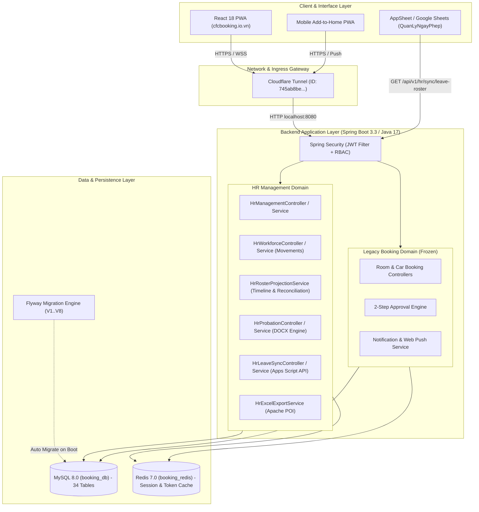

# Tổng Hợp Hệ Thống CFCBase & Quản Lý Nhân Sự Hiện Hành

> **Tài liệu nguồn chuẩn duy nhất (Single Source of Truth) cho toàn bộ hệ thống CFCBase & Quản Lý Ngày Phép.**  
> Ngày cập nhật: **2026-08-20** (Production Master Baseline: 338 Nhân sự T8-2026, 3 Ứng viên Thử việc, HĐTV DOCX Engine, Apps Script 2-Way Sync).  
> Phạm vi: `backend/`, `frontend/`, `deployserver/linux/`, `clean_database_master.sql`, `Danh sách nhân sự 2026.xlsx`, và tích hợp `AppScriptsCFC/QuanLyNgayPhep/`.

---

## 1. Mục Tiêu & Phạm Vi Hệ Thống

CFCBase là hệ thống nền tảng quản trị điều hành nội bộ của **Công ty Cổ phần Phân bón và Hóa chất Cần Thơ (CFC)**. Hệ thống bao gồm 3 phân hệ chính:

1. **Quản lý Nhân sự (HR Management Core)**: *Phân hệ đang phát triển và vận hành tích cực*.
   - Quản lý hồ sơ **338 nhân sự chính thức tháng T8-2026** (thông tin cá nhân, CCCD/CMND, BHXH, BHYT, mức lương, phụ cấp, hợp đồng, ngày phép năm).
   - Quản lý vòng đời biến động **Tăng / Giảm nhân sự (Movements)** kèm cơ chế xác nhận nguyên tử (Atomic Confirmation) và xem trước ảnh hưởng (Impact Preview).
   - Quản lý quân số tháng (**Monthly Rosters**) và **Đối soát quân số tự động** kế thừa từ nền T6/T7 sang T8.
   - Quản lý quy trình **Thử việc (Probation)**, đánh giá đạt/không đạt, và **tự động sinh file Word Hợp đồng thử việc (.docx)** chuẩn văn bản công ty.
   - Quản lý **Lao động phổ thông (General Labor)** và tiếp nhận nhanh.
   - Xuất báo cáo nhân sự định dạng Microsoft Excel (`.xlsx`) theo tháng và theo năm.
2. **Tích hợp Đồng bộ Ngày Phép (Leave Sync Integration)**:
   - Cung cấp API chuẩn cho **Google Apps Script / AppSheet (`QuanLyNgayPhep`)**.
   - Phân định quyền sở hữu dữ liệu: CFCBase quản lý hạn mức phép gốc & thông tin nhân sự; App Ngày Phép quản lý giao dịch nghỉ phép hàng ngày và số ngày phép đã sử dụng (`used_days`), không bị ghi đè hay mất dữ liệu khi đồng bộ.
3. **Đặt Phòng họp & Đặt Xe công tác (Legacy Booking)**: *Phân hệ kế thừa đã đóng băng (frozen)*.
   - Đặt lịch phòng họp, xe công tác, quy trình phê duyệt 2 cấp (`PENDING` $\rightarrow$ `APPROVED` / `REJECTED`).
   - Web Push Notifications & Email thông báo.

---

## 2. Kiến Trúc Tổng Quan (System Architecture)



---

## 3. Cây Thư Mục Chi Tiết & Vai Trò Từng File (Code Map)

```text
CFCBase/
├── AGENTS.md                               # Chỉ dẫn AI: Luật bất biến, checklist an ninh, canonical roadmap
├── docker-compose.yml                      # Chạy MySQL (booking_db:3306) & Redis (booking_redis:6379)
├── clean_database_master.sql               # DDL + DML Master CSDL 34 bảng, 338 nhân sự T8-26, 3 ứng viên thử việc
├── Danh sách nhân sự 2026.xlsx             # File Excel gốc của công ty (Sheet T8-26 là nguồn sự thật 338 nhân sự)
│
├── backend/                                # [SPRING BOOT BACKEND]
│   ├── pom.xml                             # Dependencies: Spring Boot 3, JPA, Security, MySQL, Redis, POI, Flyway
│   ├── mvnw / mvnw.cmd                     # Maven wrapper
│   └── src/main/
│       ├── java/com/booking/system/
│       │   ├── BookingSystemApplication.java # Main application entry point
│       │   ├── config/                     # Cấu hình bảo mật & hạ tầng
│       │   │   ├── SecurityConfig.java         # Spring Security filter chain, RBAC rules, CSRF disabled
│       │   │   ├── CorsConfig.java             # Cho phép cfcbooking.io.vn, localhost:5173, localhost:8080
│       │   │   ├── JwtAuthenticationFilter.java# Interceptor trích xuất Bearer JWT, kiểm tra Redis blacklist
│       │   │   ├── JwtTokenProvider.java       # Sinh & giải mã JWT access/refresh token
│       │   │   └── RedisConfig.java            # Lettuce connection factory & RedisTemplate
│       │   │
│       │   ├── hr/                         # [PHÂN HỆ HR CORE DOMAIN]
│       │   │   ├── api/                    # REST Controllers
│       │   │   │   ├── HrManagementController.java   # /api/v1/hr (Tổng quan, DS 338 nhân sự, tìm kiếm, lọc)
│       │   │   │   ├── HrWorkforceController.java    # /api/v1/hr/movements (Tạo/Duyệt/Hủy biến động Tăng/Giảm)
│       │   │   │   ├── HrProbationController.java    # /api/v1/hr/probation (Ứng viên thử việc, HĐTV DOCX, Mẫu việc)
│       │   │   │   ├── HrLeaveSyncController.java    # /api/v1/hr/sync/leave-roster (Đồng bộ Google Apps Script)
│       │   │   │   ├── HrOnboardingController.java   # /api/v1/hr/onboarding (Tiếp nhận LĐPT & Chuyển thử việc)
│       │   │   │   ├── HrImportController.java       # /api/v1/hr/imports (Nhập file Excel nhân sự)
│       │   │   │   ├── HrActivityController.java     # /api/v1/hr/audit (Nhật ký kiểm toán biến động)
│       │   │   │   ├── HrEmploymentContractController.java # /api/v1/hr/employment-contracts (HĐLĐ chính thức)
│       │   │   │   ├── HrEmployeeDocumentController.java   # /api/v1/hr/employee-documents (Hồ sơ giấy tờ scan)
│       │   │   │   └── dto/                      # DTOs & Records request/response
│       │   │   │
│       │   │   ├── service/                # Business Logic Services
│       │   │   │   ├── HrManagementService.java      # CRUD nhân sự, phân trang, lọc theo phòng ban/chức vụ
│       │   │   │   ├── HrWorkforceService.java       # Xử lý biến động Tăng/Giảm, vòng đời nhân sự nguyên tử
│       │   │   │   ├── HrRosterProjectionService.java# Tính toán quân số các tháng động từ baseline T6 + movements
│       │   │   │   ├── HrProbationService.java       # Quản lý thử việc, render template DOCX hợp đồng
│       │   │   │   ├── HrLeaveSyncService.java       # Tính thâm niên (Năm-Tháng-Ngày), hạn mức phép xuất Apps Script
│       │   │   │   ├── HrExcelExportService.java     # Xuất file Excel báo cáo quân số tháng/năm
│       │   │   │   ├── HrLeaveEntitlementService.java# Quản lý ngày phép năm và điều chỉnh thủ công
│       │   │   │   └── HrActorResolver.java          # Trích xuất thông tin người thực hiện từ JWT Principal
│       │   │   │
│       │   │   ├── entity/                 # JPA Entities HR
│       │   │   │   ├── HrEmployee.java               # Bảng `hr_employees` (Mã NV, Họ tên, Trạng thái, Nhóm)
│       │   │   │   ├── HrEmployeeEmployment.java     # Bảng `hr_employee_employment` (Phòng ban, Chức vụ, Lương)
│       │   │   │   ├── HrEmployeeIdentity.java       # Bảng `hr_employee_identity` (CCCD/CMND, Ngày/Nơi cấp)
│       │   │   │   ├── HrEmployeeInsurance.java      # Bảng `hr_employee_insurance` (Sổ BHXH, BHYT)
│       │   │   │   ├── HrEmployeeContacts.java       # Bảng `hr_employee_contacts` (Địa chỉ, SĐT, Email)
│       │   │   │   ├── HrEmployeeLeaveEntitlement.java# Bảng `hr_employee_leave_entitlements` (Phép năm)
│       │   │   │   ├── HrMonthlyRoster.java          # Bảng `hr_monthly_rosters` (Kỳ quân số tháng T6..T8)
│       │   │   │   ├── HrMonthlyRosterItem.java      # Bảng `hr_monthly_roster_items` (Snapshot nhân sự tháng)
│       │   │   │   ├── HrEmployeeMovement.java       # Bảng `hr_employee_movements` (Biến động Tăng/Giảm)
│       │   │   │   ├── HrProbationCandidate.java     # Bảng `hr_probation_candidates` (Ứng viên thử việc)
│       │   │   │   ├── HrProbationContract.java      # Bảng `hr_probation_contracts` (HĐTV binary DOCX)
│       │   │   │   ├── HrProbationJobTemplate.java   # Bảng `hr_probation_job_templates` (Mẫu công việc)
│       │   │   │   ├── HrDepartment.java             # Bảng `hr_departments` (22 phòng ban)
│       │   │   │   ├── HrPosition.java               # Bảng `hr_positions` (43 chức vụ)
│       │   │   │   ├── HrWorkingCondition.java       # Bảng `hr_working_conditions` (2 ĐKLĐ)
│       │   │   │   └── HrAuditEvent.java             # Bảng `hr_audit_events` (Kiểm toán)
│       │   │   │
│       │   │   ├── repository/             # Spring Data JPA Repositories
│       │   │   └── enums/                  # Enums HR (HrEmploymentStatus, HrMovementType, HrProbationCandidateStatus...)
│       │   │
│       │   ├── controller/                 # Legacy Booking Controllers (Room, Car, Approval, User, Notification)
│       │   ├── service/                    # Legacy Booking Services
│       │   └── entity/                     # Legacy Entities (User, Room, Vehicle, BookingRoom, BookingCar...)
│       │
│       └── resources/
│           ├── application.properties      # Cấu hình dev local (H2/MySQL, JPA, Port 8080)
│           ├── application-prod.properties # Cấu hình production (MySQL, Redis, Cloudflare, Mail, VAPID)
│           ├── db/migration/               # Flyway SQL migrations:
│           │   ├── V1__create_hr_phase_1_schema.sql
│           │   ├── V2__add_hr_excel_import_tables.sql
│           │   ├── V3__add_hr_probation_candidates.sql
│           │   ├── V4__add_general_labor_and_onboarding.sql
│           │   ├── V5__add_hr_contracts_and_documents.sql
│           │   ├── V6__add_base_salary_to_probation.sql
│           │   ├── V7__expand_contract_type_label_length.sql
│           │   └── V8__add_cancelled_at_to_employee_movements.sql
│           └── hr/templates/
│               └── probation-contract-template.docx # File mẫu DOCX gốc để sinh HĐTV
│
├── frontend/                               # [REACT VITE FRONTEND]
│   ├── package.json                        # Dependencies: React 18, Tailwind, Lucide, Axios
│   ├── vite.config.js                      # Cấu hình build & dev server proxy sang backend :8080
│   └── src/
│       ├── App.jsx                         # React Router: Public routes, Protected routes, Manager HR routes
│       ├── api/                            # Axios API Clients
│       │   ├── baseApi.js                  # Axios interceptor, quản lý token header & refresh token
│       │   ├── hrEmployeeApi.js            # Gọi API nhân sự: getEmployees, getEmployee, create, update
│       │   ├── hrActivityApi.js            # Gọi API biến động (Movements), danh sách tháng (Rosters)
│       │   ├── hrProbationApi.js           # Gọi API thử việc: getCandidates, generateContract, downloadContract
│       │   ├── hrOnboardingApi.js          # Gọi API lao động phổ thông & hoàn tất thử việc
│       │   ├── hrCatalogApi.js             # Gọi API danh mục: departments, positions, working-conditions
│       │   └── authApi.js                  # Gọi API login, refresh token, profile
│       ├── pages/hr/                       # 12 Màn hình quản trị HR
│       │   ├── HrOverview.jsx              # Dashboard tổng quan nhân sự, lối tắt chức năng
│       │   ├── HrEmployees.jsx             # Danh sách 338 nhân sự (Search, Filter, Pagination)
│       │   ├── HrEmployeeDetail.jsx        # Xem chi tiết hồ sơ nhân sự (CCCD, Lương, BHXH, Phép)
│       │   ├── HrEmployeeForm.jsx          # Form thêm mới / cập nhật nhân sự
│       │   ├── HrMovements.jsx             # Quản lý biến động Tăng / Giảm nhân sự
│       │   ├── HrRosters.jsx               # Danh sách theo tháng & Bảng Đối soát quân số
│       │   ├── HrRosterDetail.jsx          # Xem chi tiết quân số từng tháng
│       │   ├── HrProbationCandidates.jsx   # Danh sách ứng viên thử việc & Nút tải file DOCX
│       │   ├── HrProbationCandidateForm.jsx# Form thêm / sửa ứng viên thử việc
│       │   ├── HrGeneralLabor.jsx          # Danh sách lao động phổ thông
│       │   ├── HrGeneralLaborOnboarding.jsx# Form tiếp nhận lao động phổ thông
│       │   └── HrCatalogs.jsx              # Quản lý danh mục phòng ban, chức vụ
│       └── components/hr/                  # UI Components (HrUi.jsx, HrFormControls.jsx, HrNavbar.jsx)
│
├── deployserver/linux/                     # [SCRIPTS VẬN HÀNH PRODUCTION LINUX]
│   ├── run.sh                              # Khởi động Docker (db, redis), Backend JAR (Systemd) & Cloudflare Tunnel
│   ├── build-prod.sh                       # Build frontend Vite, package Backend JAR, gọi run.sh
│   ├── backup-database.sh                  # Backup database tự động hàng ngày
│   └── restore-database.sh                 # Phục hồi CSDL từ file backup .sql.gz
│
├── skills/                                 # [QUY CHUẨN KỸ THUẬT & SKILLS]
│   ├── architecture.md                     # Domain Knowledge: Tài nguyên (Resources), Vòng đời mượn & duyệt
│   ├── backend-springboot.md               # Quy chuẩn Backend: Java 17/21, Spring Boot 3, DTOs, Pessimistic/Optimistic Lock
│   ├── frontend-react-ui.md                # Quy chuẩn Frontend: React 18, Vite, Tailwind v4, Dedicated Subpages (No Modals)
│   ├── desige.md                           # Triết lý thiết kế UI/UX: Sang trọng, HSL palette, tối ưu trải nghiệm Mobile
│   └── mail.md                             # Quy chuẩn Email & Notification
│
└── documents/                              # [TÀI LIỆU HỆ THỐNG MASTER]
    ├── PROJECT_MASTER_CONTEXT.md           # File Master Context duy nhất này
    ├── DATABASE_BACKUP.md                  # Hướng dẫn backup & restore database
    └── hrdocsthuviec/                      # Mẫu Word thực tế (Mẫu HĐLĐ 2026.docx, Mẫu HĐTV 2026.docx)
```

---

## 4. Từ Điển Dữ Liệu & Cơ Sở Dữ Liệu Master (34 Bảng)

Toàn bộ CSDL được khởi tạo sạch trong [`clean_database_master.sql`](file:///Users/hyden/Documents/David-nguyen/CFCBase/clean_database_master.sql).

### 4.1 Bảng Nhân sự cốt lõi: `hr_employees` (338 dòng)
| Cột | Kiểu | Ràng buộc | Ý nghĩa |
|---|---|---|---|
| `id` | `varchar(36)` | PK, UUID | Định danh duy nhất nhân viên |
| `employee_code` | `varchar(32)` | UNIQUE, NOT NULL | Mã nhân viên (VD: `A268`, `A035`, `C690`...) |
| `full_name` | `varchar(255)` | NOT NULL | Họ và tên |
| `gender` | `varchar(16)` | `MALE`, `FEMALE`, `UNKNOWN` | Giới tính |
| `date_of_birth` | `date` | NULLABLE | Ngày sinh |
| `ethnicity` | `varchar(64)` | DEFAULT 'Kinh' | Dân tộc |
| `religion` | `varchar(64)` | DEFAULT 'Không' | Tôn giáo |
| `birth_place_original` | `varchar(255)` | NULLABLE | Nơi sinh theo khai sinh |
| `education_level` | `varchar(128)` | NULLABLE | Trình độ học vấn |
| `major` | `varchar(255)` | NULLABLE | Chuyên ngành |
| `employment_status` | `varchar(32)` | `ACTIVE`, `INACTIVE`, `DRAFT`, `TERMINATED` | Trạng thái làm việc |
| `status_effective_date`| `date` | NOT NULL | Ngày hiệu lực trạng thái |
| `workforce_group` | `varchar(32)` | `OFFICE`, `GENERAL_LABOR` | Khối nhân sự (Văn phòng / Phổ thông) |
| `onboarding_source` | `varchar(32)` | `LEGACY`, `PROBATION`, `GENERAL_LABOR` | Nguồn tiếp nhận |
| `row_version` | `bigint` | DEFAULT 0 | Khóa lạc quan (Optimistic Locking) |

### 4.2 Bảng Hợp đồng & Công việc: `hr_employee_employment` (338 dòng)
| Cột | Kiểu | Ràng buộc | Ý nghĩa |
|---|---|---|---|
| `employee_id` | `varchar(36)` | PK, FK $\rightarrow$ `hr_employees.id` | Mã định danh nhân viên |
| `department_id` | `varchar(36)` | FK $\rightarrow$ `hr_departments.id` | Phòng ban công tác |
| `position_id` | `varchar(36)` | FK $\rightarrow$ `hr_positions.id` | Chức vụ |
| `working_condition_id`| `varchar(36)` | FK $\rightarrow$ `hr_working_conditions.id`| Điều kiện làm việc (Bình thường / Nặng nhọc) |
| `hire_date` | `date` | NOT NULL | Ngày vào làm chính thức |
| `contract_type_label` | `varchar(255)`| NULLABLE | Loại hợp đồng (VD: HĐLĐ không xác định thời hạn) |
| `contract_number` | `varchar(128)` | NULLABLE | Số hợp đồng lao động |
| `base_salary` | `decimal(15,2)`| DEFAULT 0 | Mức lương chính |
| `allowance` | `decimal(15,2)`| DEFAULT 0 | Phụ cấp lương |
| `job_description` | `varchar(2000)`| NULLABLE | Mô tả công việc |

### 4.3 Bảng Thử việc: `hr_probation_candidates` & `hr_probation_contracts`
- `hr_probation_candidates`: 3 ứng viên thực tế:
  - `Lê Huy Hào` (`TV-260814031002`, Phòng Kỹ thuật, Lương: 7.500.000).
  - `Nguyễn Việt Khoa` (`TV-260814032152`, Phòng XNK, Lương: 8.000.000).
  - `Nguyễn Trung Thuận` (`TV-260727064228`, Phòng TCHC, Lương: 7.500.000).
- `hr_probation_contracts`: Lưu file Word DOCX nhị phân (`generated_docx`: `longblob`) và JSON snapshot placeholders (`snapshot_payload`).

### 4.4 Bảng Quân số tháng: `hr_monthly_rosters` & `hr_monthly_roster_items`
- `hr_monthly_rosters`:
  - `2026-06-01` (`c895cc0b-...`): Baseline T6 (338 người, `CLOSED`).
  - `2026-07-01` (`9847303a-...`): Roster T7 (338 người, `CLOSED`).
  - `2026-08-01` (`roster-2026-08`): Roster T8 hiện tại (338 người, `OPEN`).
- `hr_monthly_roster_items`: Snapshot 338 nhân sự cho từng tháng kèm hash SHA-256 bảo toàn toàn vẹn.

---

## 5. Nghiệp vụ Quản lý Nhân sự (HR Core Deep Dive)

### 5.1 Quản lý 338 Nhân sự Chính thức (Master 338)
- Nguồn sự thật là sheet `T8-26` của [`Danh sách nhân sự 2026.xlsx`](file:///Users/hyden/Documents/David-nguyen/CFCBase/Danh%20sách%20nhân%20sự%202026.xlsx).
- Ngày phép năm 2026 (`leave_days`): Tự động tính dựa trên thâm niên (cứ 5 năm làm việc cộng 1 ngày phép) + Điều kiện làm việc (Nặng nhọc độc hại hưởng 14 ngày, Bình thường hưởng 12 ngày).
- Form quản lý cho phép sửa thông tin cá nhân, chuyển phòng ban, nâng lương hoặc điều chỉnh ngày phép.

### 5.2 Biến động Tăng / Giảm Nhân sự (Movements)
- **Tăng nhân sự (`INCREASE`, `REHIRE`)**: Tạo hồ sơ tiếp nhận, gán ngày hiệu lực (`effective_date`), sau khi bấm `Confirm` hồ sơ chuyển thành `ACTIVE` và tự động cộng vào quân số tháng.
- **Giảm nhân sự (`DECREASE`)**: Ghi nhận lý do thôi việc, ngày thôi việc, sau khi bấm `Confirm` hồ sơ chuyển thành `INACTIVE` (`termination_date` được ghi nhận) và trừ khỏi quân số tháng từ ngày hiệu lực.
- **Xem trước ảnh hưởng (`Impact Preview`)**: Trước khi xác nhận biến động, HR có thể xem trước biến động này sẽ làm tăng/giảm quân số của những tháng nào trong tương lai.

### 5.3 Engine Xuất Hợp Đồng Thử Việc DOCX
```text
Thêm/Sửa Ứng viên Thử việc 
→ Bấm "Tạo hợp đồng" (POST /api/v1/hr/probation/candidates/{id}/contracts)
→ Đọc template backend/src/main/resources/hr/templates/probation-contract-template.docx
→ Unzip template → Mở file word/document.xml
→ Thay thế toàn bộ placeholder:
    {{FULL_NAME}}          → Lê Huy Hào
    {{CITIZEN_ID}}         → 093202002984
    {{BASE_SALARY_TEXT}}   → 7.500.000
    {{POSITION_NAME}}      → Nhân viên phòng kỹ thuật
    {{PROBATION_START_DATE}} → 23/04/2026 ...
→ Zip lại thành file .docx nhị phân hoàn chỉnh
→ Lưu vào hr_probation_contracts.generated_docx
→ Bấm "Tải hợp đồng" → Nhận file .docx chuẩn 100% mở ngay trên Microsoft Word / Apple Pages.
```

---

## 6. Cơ Chế Đồng Bộ 2 Chiều với Quản Lý Ngày Phép (Google Apps Script)

### 6.1 Endpoint Tích Hợp
`GET https://cfcbooking.io.vn/api/v1/hr/sync/leave-roster?period=T8-26&activeOnly=false`

### 6.2 Ma trận Phân định Quyền Sở hữu Dữ liệu (Data Ownership Matrix)
| Dữ liệu | Bên làm chủ (Owner) | Hành vi khi đồng bộ |
|---|---|---|
| **Mã NV, Họ Tên, Phòng ban, Chức vụ, Ngày vào làm** | **CFCBase** | Cập nhật mới nhất từ CFCBase sang Google Sheet. |
| **Tổng hạn mức phép năm (`annual_leave_days`)** | **CFCBase** | Đẩy số ngày được hưởng gốc (12, 14, 15...) sang Sheet. |
| **Số ngày phép ĐÃ NGHỈ (`used_days`)** | **App Ngày Phép** | **BẢO TOÀN 100%**, CFCBase không được reset về 0. |
| **Phép tồn năm trước chuyển sang** | **App Ngày Phép** | **BẢO TOÀN 100%**. |
| **Số ngày phép CÒN LẠI (`remaining_days`)** | **Công thức App Ngày Phép** | Tự động tính: `(Phép tồn + Hạn mức năm) - Đã nghỉ`. |
| **Nhân sự đã thôi việc (`INACTIVE`)** | **CFCBase** | Đổi trạng thái thành `ĐÃ NGHỈ VIỆC`, **TUYỆT ĐỐI KHÔNG XÓA DÒNG** trên Sheet để bảo toàn lịch sử đơn phép cũ. |

### 6.3 Thuật toán Đồng bộ trong [`QuanLyNgayPhep/Code.js`](file:///Users/hyden/Documents/David-nguyen/AppScriptsCFC/QuanLyNgayPhep/Code.js)
```javascript
function syncFromCFCBase(options) {
  // 1. Gọi API lấy 338 nhân sự từ CFCBase
  var response = UrlFetchApp.fetch(apiUrl);
  var items = JSON.parse(response.getContentText()).data;

  // 2. Map dữ liệu nhân sự, giữ lại used_days và pending_days hiện có
  items.forEach(function(item) {
    var existing = existingMap[item.employeeCode];
    rows.push({
      employee_code: item.employeeCode,
      full_name: item.fullName,
      annual_leave_days: item.annualLeaveDays,
      used_days: existing ? existing.used_days : 0,
      working_condition: item.employmentStatus === 'ACTIVE' ? item.workingCondition : 'ĐÃ NGHỈ VIỆC'
    });
  });

  // 3. Giữ lại nhân sự cũ trên Sheet không nằm trong API (chuyển sang ĐÃ NGHỈ VIỆC)
  existingEmployees.forEach(function(emp) {
    if (!syncedCodes[emp.employee_code]) {
      emp.working_condition = 'ĐÃ NGHỈ VIỆC';
      rows.push(emp);
    }
  });

  // 4. Quét toàn bộ đơn đã duyệt trong LEAVE_REQUESTS để tính lại used_days chính xác
  var recalculated = recalculate_(rows);
  LeaveStore.replaceAll(LeaveConfig.TABLES.EMPLOYEES, recalculated);
}
```

---

## 7. Phân Hệ Đặt Phòng & Đặt Xe (Legacy Booking - Đóng Băng)

- **Quy tắc**: Phân hệ này đã hoàn thiện và đóng băng. Không sửa đổi logic hoặc cấu trúc bảng trừ khi có yêu cầu đặc biệt.
- **Luồng duyệt**:
  1. Người dùng tạo đơn đặt phòng (`booking_rooms`) hoặc đặt xe (`booking_cars`) $\rightarrow$ Trạng thái `PENDING`.
  2. Tạo bản ghi `approval_steps` cấp 1 và cấp 2.
  3. Người phê duyệt nhận thông báo qua Web Push & chuông ứng dụng $\rightarrow$ Bấm Duyệt (`APPROVED`) hoặc Từ chối (`REJECTED`).
  4. Thuật toán kiểm tra trùng lịch (Overlap Check): `existing_start < new_end AND existing_end > new_start` với trạng thái chặn `PENDING` và `APPROVED`.

---

## 8. Bảo Mật & Xác Thực (Security & RBAC)

- **Cơ chế**: JWT Stateless (Access Token 15 phút, Refresh Token 7 ngày lưu Redis).
- **Redis Blacklist**: Khi người dùng Logout hoặc đổi mật khẩu, token cũ bị đưa vào Blacklist trên Redis (`booking_redis:6379`).
- **Phân quyền vai trò (Roles)**:
  - `ROLE_ADMIN`: Toàn quyền quản trị hệ thống, quản lý tài khoản người dùng, cấu hình.
  - `ROLE_MANAGER`: Quản lý toàn diện phân hệ HR (Nhân sự, Thử việc, Biến động, Danh mục, Xuất báo cáo, Đồng bộ).
  - `ROLE_APPROVER`: Duyệt các yêu cầu đặt phòng họp / xe công tác.
  - `ROLE_USER`: Đặt phòng/xe, xem thông tin cá nhân, gửi yêu cầu sửa hồ sơ.

---

## 9. Danh Mục API Endpoints Chính

| Phân hệ | Phương thức | Endpoint | Quyền | Chức năng |
|---|---|---|---|---|
| **Auth** | `POST` | `/api/v1/auth/login` | Public | Đăng nhập hệ thống, trả về JWT & Role |
| **Auth** | `POST` | `/api/v1/auth/refresh` | Public | Làm mới Access Token |
| **HR** | `GET` | `/api/v1/hr/overview` | `MANAGER`, `ADMIN` | Thống kê tổng quan nhân sự |
| **HR** | `GET` | `/api/v1/hr/employees` | `MANAGER`, `ADMIN` | Danh sách 338 nhân sự (Search, Filter, Page) |
| **HR** | `GET` | `/api/v1/hr/employees/{id}` | `MANAGER`, `ADMIN` | Chi tiết hồ sơ nhân sự |
| **HR** | `POST` | `/api/v1/hr/employees` | `MANAGER`, `ADMIN` | Thêm mới nhân sự |
| **HR** | `PATCH` | `/api/v1/hr/employees/{id}` | `MANAGER`, `ADMIN` | Cập nhật hồ sơ nhân sự |
| **HR** | `GET` | `/api/v1/hr/movements` | `MANAGER`, `ADMIN` | Danh sách biến động Tăng / Giảm |
| **HR** | `POST` | `/api/v1/hr/movements` | `MANAGER`, `ADMIN` | Tạo biến động nháp |
| **HR** | `POST` | `/api/v1/hr/movements/{id}/confirm` | `MANAGER`, `ADMIN` | Xác nhận biến động nguyên tử |
| **HR** | `POST` | `/api/v1/hr/movements/{id}/cancel` | `MANAGER`, `ADMIN` | Hủy biến động |
| **HR** | `GET` | `/api/v1/hr/rosters` | `MANAGER`, `ADMIN` | Danh sách quân số theo tháng |
| **HR** | `GET` | `/api/v1/hr/rosters/reconciliation` | `MANAGER`, `ADMIN` | Bảng đối soát quân số các tháng |
| **HR** | `GET` | `/api/v1/hr/probation/candidates` | `MANAGER`, `ADMIN` | Danh sách ứng viên thử việc |
| **HR** | `POST` | `/api/v1/hr/probation/candidates/{id}/contracts` | `MANAGER`, `ADMIN` | Sinh hợp đồng thử việc DOCX |
| **HR** | `GET` | `/api/v1/hr/probation/contracts/{id}/download` | `MANAGER`, `ADMIN` | Tải file Word HĐTV DOCX |
| **Sync** | `GET` | `/api/v1/hr/sync/leave-roster` | `MANAGER`, `ADMIN` | API đồng bộ Google Apps Script |
| **Export**| `GET` | `/api/v1/hr/exports/month` | `MANAGER`, `ADMIN` | Xuất Excel báo cáo tháng |
| **Export**| `GET` | `/api/v1/hr/exports/year` | `MANAGER`, `ADMIN` | Xuất Excel báo cáo năm |

---

## 10. Hướng Dẫn Vận Hành & Triển Khai

### 10.1 Khởi động Môi trường Local (macOS):
```bash
# 1. Bật MySQL & Redis
docker compose up -d db redis

# 2. Khởi động Backend (Port 8080)
cd backend && ./mvnw spring-boot:run

# 3. Khởi động Frontend (Port 5173)
cd frontend && npm run dev
```

### 10.2 Triển khai Production VPS (Ubuntu Linux):
```bash
# 1. Kéo code mới và nạp CSDL Master sạch
git pull
docker compose up -d db redis
docker exec -i booking_db mysql -uroot -prootpassword booking_db < clean_database_master.sql

# 2. Build production và khởi động toàn bộ dịch vụ
./deployserver/linux/build-prod.sh

# 3. Hoặc chỉ khởi động lại dịch vụ không build:
./deployserver/linux/run.sh
```

### 10.3 Kiểm tra tình trạng dịch vụ Production:
- **Trang chủ Web**: `https://cfcbooking.io.vn`
- **Backend API Health**: `https://api.cfcbooking.io.vn/api/v1/auth/login`
- **Xem log Backend**: `tail -f /tmp/bookingbase/backend.log`
- **Xem log Cloudflare Tunnel**: `tail -f /tmp/bookingbase/cloudflared.log`

---

## 11. Các Tình Huống Xử Lý Sự Cố Thường Gặp (Troubleshooting)

1. **Lỗi Redis `NOAUTH Authentication required`**:
   - Nguyên nhân: Có container Redis cũ đặt mật khẩu đang chiếm port 6379.
   - Xử lý: Dừng container cũ, chạy đúng container của dự án: `docker compose up -d redis`.
2. **Lỗi `Table doesn't exist` hoặc `Unknown column` sau khi nạp CSDL**:
   - Nguyên nhân: Nạp thiếu schema Flyway V1..V8.
   - Xử lý: Nạp lại file [`clean_database_master.sql`](file:///Users/hyden/Documents/David-nguyen/CFCBase/clean_database_master.sql), file này đã chứa trọn vẹn 34 bảng và toàn bộ 10 bản ghi lịch sử Flyway.
3. **Lỗi tải file Word hợp đồng thử việc "The file format is invalid"**:
   - Nguyên nhân: Cột `generated_docx` trong DB bị lưu chuỗi ngắn thay vì dữ liệu nhị phân DOCX.
   - Xử lý: Chạy lại `python3 scripts/render_real_contract_docx.py` để render lại file Word DOCX chuẩn.

---

## 12. Quy Tắc Bất Biến dành cho AI Developers

1. **Bảo toàn Số lượng Nhân sự Master**: Luôn giữ đúng **338 nhân sự chính thức T8-2026** và **3 ứng viên thử việc thực tế** (`Lê Huy Hào`, `Nguyễn Việt Khoa`, `Nguyễn Trung Thuận`). Không tự ý thêm bớt hoặc đổi tên dữ liệu chuẩn.
2. **Bảo toàn Phân hệ Legacy Booking**: Không xóa, đổi tên bảng, hoặc thay đổi logic của các bảng `booking_rooms`, `booking_cars`, `approval_steps`, `users`, `notifications`.
3. **Bảo toàn Ngày phép khi Đồng bộ**: Logic đồng bộ sang Google Apps Script (`QuanLyNgayPhep`) phải luôn tuân thủ nguyên tắc: **Không reset `used_days`** và **Không xóa dòng nhân viên đã nghỉ việc**.
4. **Tuyệt đối không commit Secret**: Mật khẩu DB, JWT Secret, VAPID Private Key, Email SMTP password chỉ được truyền qua file `.env` hoặc biến môi trường, không đưa vào git commit.
